# 🤖 Kairos Agent

> FastAPI-powered AI agent for restaurant discovery, personalisation, and allergy safety — the intelligence core of the Kairos platform.

---

## 📋 Table of Contents

1. [Overview](#-overview)
2. [Folder Structure](#-folder-structure)
3. [Setup & Installation](#-setup--installation)
4. [Key Components](#-key-components)
   - [main.py — Application Entry Point](#mainpy--application-entry-point)
   - [config.py — Settings](#configpy--settings)
   - [database.py — Database Layer](#databasepy--database-layer)
   - [Models](#models)
   - [Routers](#routers)
   - [Services](#services)
   - [Utils](#utils)
5. [API Reference](#-api-reference)
6. [Mermaid Diagrams](#-mermaid-diagrams)
7. [Configuration](#-configuration)
8. [Testing](#-testing)
9. [Known Issues / TODOs](#-known-issues--todos)

---

## 🧭 Overview

The Kairos Agent is a FastAPI microservice that powers the AI features of the Beyond Stars platform. It handles every user chat message through a five-step ReAct reasoning loop, provides a personalised daily restaurant feed via the Recommendation System, and enforces a mandatory allergy safety layer on every result it returns.

The Agent maintains its own PostgreSQL database (separate from the Django Backend's SQLite) and is the sole owner of user preferences, interaction history, restaurant data, and vector embeddings. It communicates with the Google AI platform for language model inference (`gemma-2-9b-it`) and semantic embeddings (`text-embedding-004`, 768 dimensions). All other logic — scoring, filtering, allergy annotation — is pure Python with no external dependencies.

---

## 🗂️ Folder Structure

```
Agent/
├── docker-compose.yml           ← PostgreSQL + pgvector container
├── requirements.txt             ← Python dependencies
├── run.sh                       ← Local server launcher script
├── run_ingest.sh                ← Dataset ingestion launcher script
├── app/
│   ├── __init__.py
│   ├── main.py                  ← FastAPI app, lifespan, CORS, routers
│   ├── config.py                ← Pydantic Settings (all env var bindings)
│   ├── database.py              ← Async engine, session factory, pgvector init
│   ├── models/
│   │   ├── __init__.py          ← Exports all models for Base.metadata
│   │   ├── user.py              ← User ORM (uid, preferences, allergies, flags)
│   │   ├── restaurant.py        ← Restaurant ORM (cuisine, allergens, geo)
│   │   ├── review.py            ← Review ORM with 768-dim vector embedding
│   │   └── interaction.py       ← Interaction ORM (full audit trail)
│   ├── routers/
│   │   ├── __init__.py
│   │   ├── chat.py              ← POST /chat — SSE streaming
│   │   ├── health.py            ← GET /health, GET /ready — probes
│   │   ├── users.py             ← /users/* — service-token-protected CRUD
│   │   └── recommendations.py   ← GET /recommendations/{uid}
│   ├── schemas/
│   │   ├── __init__.py
│   │   ├── chat.py              ← ChatRequest, ChatMessage
│   │   ├── restaurant.py        ← AllergyWarning, RadarScores, RestaurantResult,
│   │   │                           GenerativeUIPayload
│   │   ├── user.py              ← UserCreate, UserRead, AllergiesPatch, etc.
│   │   └── recommendation.py    ← FitTag, RecommendationItem, RecommendationPayload,
│   │                               ExpandedDetail, UserProfile
│   ├── services/
│   │   ├── __init__.py
│   │   ├── orchestrator.py      ← 5-step AI reasoning loop
│   │   ├── allergy_guard.py     ← Safety layer (never optional)
│   │   ├── hybrid_search.py     ← SQL + pgvector search
│   │   ├── fit_scorer.py        ← Pure-Python 0–100 restaurant scorer
│   │   ├── gemma.py             ← Google Gemma-2 API wrapper
│   │   ├── embedding.py         ← Google text-embedding-004 wrapper
│   │   ├── profiler.py          ← Background preference extractor
│   │   ├── recommendation_service.py ← Full recommendation pipeline + cache
│   │   ├── chroma_client.py     ← ChromaDB singleton (alternative vector store)
│   │   └── local_ml.py          ← Optional local GPU inference components
│   └── utils/
│       ├── __init__.py
│       ├── allergy_data.py      ← Canonical allergens, synonyms, cuisine map
│       └── prompts.py           ← All Gemma prompt templates
├── docs/
│   ├── ARCHITECTURE.md          ← Extended architecture reference
│   └── BACKEND_INTEGRATION_REPORT.md ← Frontend integration guide
└── scripts/
    ├── ingest.py                ← Zomato Bangalore CSV ingestion
    └── create_tables.py         ← Idempotent table creation utility
```

---

## ⚙️ Setup & Installation

### 1. Start the database

```bash
cd Agent
docker compose up -d
docker compose ps   # wait for healthy status
```

### 2. Create and activate a virtualenv

```bash
python3 -m venv .venv
source .venv/bin/activate
```

### 3. Install dependencies

```bash
pip install --upgrade pip
pip install -r requirements.txt
```

### 4. Configure environment

```bash
cp ../.env.example .env
# Edit .env — at minimum set DATABASE_URL, GOOGLE_API_KEY, SERVICE_TOKEN,
# POSTGRES_DB, POSTGRES_USER, POSTGRES_PASSWORD
```

### 5. Create database tables

```bash
python scripts/create_tables.py
```

### 6. Ingest restaurant data

```bash
# Download from: https://www.kaggle.com/datasets/himanshupoddar/zomato-bangalore-restaurants
# Place at: Agent/data/zomato.csv

# Dry run (no DB writes — verifies parsing):
python scripts/ingest.py --csv data/zomato.csv --dry-run

# Full ingest:
python scripts/ingest.py --csv data/zomato.csv
```

### 7. Start the server

```bash
./run.sh
# Or directly:
uvicorn app.main:app --host 0.0.0.0 --port 4021 --reload
```

---

## 🔑 Key Components

### `main.py` — Application Entry Point

Defines the FastAPI application instance with a lifespan context manager that runs on startup:
1. Ensures the `pgvector` PostgreSQL extension exists (`CREATE EXTENSION IF NOT EXISTS vector`)
2. Creates all ORM-defined tables idempotently (`Base.metadata.create_all`)
3. Verifies database connectivity with a `SELECT 1` probe

Mounts CORS middleware and registers three routers: `health`, `chat`, `users`. A global exception handler intercepts all unhandled errors and returns a machine-readable `AGENT_UNAVAILABLE` JSON payload rather than a raw 500.

**Key symbols:**

| Symbol | Type | Description |
|--------|------|-------------|
| `app` | `FastAPI` | Application instance (title: "Kairos Agent", version: "1.0.0") |
| `lifespan` | `asynccontextmanager` | Startup/shutdown handler |
| `global_exception_handler` | Exception handler | Returns `{"detail": "...", "code": "AGENT_UNAVAILABLE"}` on any unhandled exception |

---

### `config.py` — Settings

Centrally manages all configuration using `pydantic-settings`. Every value is loaded from environment variables or the `.env` file — no hardcoded values exist in the rest of the codebase.

**`Settings` class fields:**

| Field | Env Var | Default | Type | Description |
|-------|---------|---------|------|-------------|
| `database_url` | `DATABASE_URL` | required | `str` | Async PostgreSQL connection string |
| `google_api_key` | `GOOGLE_API_KEY` | required | `str` | Google AI API key |
| `gemma_model` | `GEMMA_MODEL` | `gemma-2-9b-it` | `str` | Gemma model identifier |
| `embedding_model` | `EMBEDDING_MODEL` | `text-embedding-004` | `str` | Embedding model identifier |
| `embedding_dimensions` | `EMBEDDING_DIMENSIONS` | `768` | `int` | Vector dimensions |
| `service_token` | `SERVICE_TOKEN` | required | `str` | Backend → Agent auth token |
| `allowed_origins` | `ALLOWED_ORIGINS` | production + localhost | `str` | Comma-separated CORS origins |
| `app_env` | `APP_ENV` | `development` | `str` | Environment name |
| `log_level` | `LOG_LEVEL` | `INFO` | `str` | Logging level |

The `get_settings()` function is decorated with `@lru_cache(maxsize=1)` so the Settings object is instantiated exactly once per process.

---

### `database.py` — Database Layer

Provides the async SQLAlchemy engine, session factory, and two utility functions used across the codebase.

| Symbol | Description |
|--------|-------------|
| `engine` | `AsyncEngine` — pool_size=10, max_overflow=20, pool_pre_ping=True |
| `AsyncSessionLocal` | `async_sessionmaker` bound to the engine, expire_on_commit=False |
| `Base` | `DeclarativeBase` — all ORM models inherit from this |
| `get_db()` | FastAPI dependency — yields an `AsyncSession`, rolls back on exception |
| `check_db_connectivity()` | Returns `True` if `SELECT 1` succeeds (used by `/ready` probe) |
| `init_pgvector()` | Executes `CREATE EXTENSION IF NOT EXISTS vector` (runs at startup) |

---

### Models

All models inherit from `Base` and live in `app/models/`. They are all imported in `app/models/__init__.py` so `Base.metadata.create_all` discovers them.

#### `User` (`users` table)

Represents an authenticated Kairos user whose `uid` is always sourced from the Django Backend (never generated by the Agent). Allergy data is stored in a separate `allergies` JSONB column — physically isolated from the `preferences` column — so a software bug cannot accidentally overwrite allergy data with preference data.

| Column | Type | Description |
|--------|------|-------------|
| `uid` | `UUID` PK | Backend-assigned UUID v4 (`auth_token`) |
| `preferences` | `JSONB` | Rich preference snapshot updated by the profiler |
| `allergies` | `JSONB` | **Safety-critical.** Only set via `/users/{uid}/allergies` |
| `allergy_flags` | `ARRAY(String)` | Flat canonical allergen list for fast GIN queries |
| `dietary_flags` | `ARRAY(String)` | e.g. `["vegetarian", "vegan"]` |
| `vibe_tags` | `ARRAY(String)` | e.g. `["quiet", "romantic", "rooftop"]` |
| `preferred_price_tiers` | `ARRAY(String)` | e.g. `["$$", "$$$"]` |
| `interaction_count` | `Integer` | Total chat turns, bumped by profiler |
| `last_active_at` | `TIMESTAMP` | Updated on every profiler run |
| `created_at` / `updated_at` | `TIMESTAMP` | Lifecycle timestamps |

#### `Restaurant` (`restaurants` table)

Represents a restaurant ingested from the Zomato Bangalore dataset. The `known_allergens` and `allergen_confidence` columns are populated during ingestion by the allergen tagger in `scripts/ingest.py`.

| Column | Type | Description |
|--------|------|-------------|
| `id` | `Integer` PK | Auto-increment |
| `name` | `Text` | Restaurant name |
| `url` / `address` / `area` / `city` | `Text` | Location metadata |
| `cuisine_types` | `ARRAY(Text)` | e.g. `["north indian", "mughlai"]` |
| `price_tier` | `String(10)` | `$` · `$$` · `$$$` · `$$$$` |
| `cost_for_two` | `Integer` | Raw cost in INR |
| `rating` | `Numeric(3,1)` | Zomato rating (0.0–5.0) |
| `votes` | `Integer` | Number of votes |
| `lat` / `lng` | `Double` | Geo coordinates |
| `known_allergens` | `ARRAY(Text)` | Allergens detected in reviews |
| `allergen_confidence` | `String(10)` | `high` · `medium` · `low` |
| `meta` | `JSONB` | Arbitrary extra metadata |
| `is_active` | `Boolean` | Soft-delete flag |

#### `Review` (`reviews` table)

Stores scraped Zomato reviews with a 768-dimensional vector embedding for cosine similarity search. The `allergen_mentions` field records which allergen keywords appeared in the review text; reviews with allergen mentions upgrade the parent restaurant's `allergen_confidence` to `'high'`.

| Column | Type | Description |
|--------|------|-------------|
| `id` | `Integer` PK | Auto-increment |
| `restaurant_id` | `Integer` FK | References `restaurants.id` (CASCADE) |
| `review_text` | `Text` | Raw review text |
| `embedding` | `Vector(768)` | Google text-embedding-004 output |
| `allergen_mentions` | `ARRAY(Text)` | Allergen keywords found in this review |
| `source` | `String(50)` | `zomato` |
| `review_date` / `review_rating` | `Date` / `Numeric` | Scraped metadata |

#### `Interaction` (`interactions` table)

Audit record of every chat turn. Stores the raw query, the complete agent response JSON, and — critically — which allergy warnings were shown. This enables a complete safety audit of what was displayed to any user at any time.

| Column | Type | Description |
|--------|------|-------------|
| `id` | `BigInteger` PK | Auto-increment |
| `uid` | `UUID` FK | References `users.uid` (CASCADE) |
| `user_query` | `Text` | Verbatim user message |
| `agent_response` | `JSONB` | Complete `GenerativeUIPayload` |
| `ui_type` / `restaurant_ids` | various | UI metadata |
| `allergy_warnings_shown` | `Boolean` | Were any warnings displayed? |
| `allergens_flagged` | `ARRAY(Text)` | Which allergens triggered warnings |
| `prompt_tokens` / `completion_tokens` | `Integer` | LLM token accounting |

---

### Routers

#### `routers/chat.py` — `POST /chat`

The primary endpoint consumed by the Frontend. Accepts a `ChatRequest` body and an `X-User-ID` UUID header, then delegates to `orchestrate()` and returns the result as a `StreamingResponse` with `Content-Type: text/event-stream`.

```python
# Request
POST /chat
Headers:
  X-User-ID: <uuid-v4>          # Authenticated user's auth_token
  Content-Type: application/json

Body:
{
  "message": "romantic dinner Koramangala under 1500",
  "conversation_history": [
    {"role": "user",      "content": "..."},
    {"role": "assistant", "content": "..."}
  ]
}

# Response (Server-Sent Events stream)
{"event": "thinking", "data": {"step": "decomposing_query"}}
{"event": "thinking", "data": {"step": "searching", "count": 15}}
{"event": "thinking", "data": {"step": "evaluating"}}
{"event": "result",   "data": { ...GenerativeUIPayload... }}
```

**Error responses:**

| Code | Condition |
|------|-----------|
| `400 MISSING_USER_ID` | `X-User-ID` is not a valid UUID v4 |
| `500 AGENT_UNAVAILABLE` | Unhandled exception (safe fallback via global handler) |

#### `routers/health.py` — Health Probes

| Endpoint | Method | Description |
|----------|--------|-------------|
| `GET /health` | Liveness | Returns `200 {"status": "ok", "version": "1.0.0"}` always |
| `GET /ready` | Readiness | Checks DB (`SELECT 1`) and embedding API; returns `200` if both pass, `503` if either fails |

#### `routers/users.py` — `/users/*`

All endpoints in this router require the `X-Service-Token` header. They are called exclusively by the Django Backend — never by the Frontend.

| Endpoint | Method | Description |
|----------|--------|-------------|
| `/users/{uid}` | `POST` | Create user (idempotent). Returns `{"uid": ..., "created": bool}` |
| `/users/{uid}` | `GET` | Read user profile and preferences |
| `/users/{uid}/preferences` | `PATCH` | Deep-merge new preferences |
| `/users/{uid}/allergies` | `PATCH` | Replace allergy data and rebuild `allergy_flags` |
| `/users/{uid}/allergies/flags` | `GET` | Return flat `allergy_flags` list for quick frontend check |
| `/users/{uid}/interactions` | `GET` | Paginated interaction history (audit log) |
| `/users/{uid}` | `DELETE` | Hard-delete user and all interactions (CASCADE) |

**`AllergiesPatch` body:**

```json
{
  "confirmed":    ["peanuts", "shellfish"],
  "intolerances": ["dairy"],
  "severity": {
    "peanuts":   "anaphylactic",
    "shellfish": "severe",
    "dairy":     "intolerance"
  }
}
```

> ⚠️ **Warning:** All allergen synonyms (e.g. `"nuts"`, `"ghee"`, `"maida"`) are normalised to their canonical form before storage. The canonical list is defined in `utils/allergy_data.py` and is the single source of truth.

#### `routers/recommendations.py` — `/recommendations/*`

| Endpoint | Method | Description |
|----------|--------|-------------|
| `GET /recommendations/{uid}` | `GET` | Returns a ranked, personalised `RecommendationPayload`. Supports `?limit=10` (1–25) and `?refresh=true` to bust the daily cache. |
| `GET /recommendations/{uid}/{restaurant_id}/expand` | `GET` | Returns `ExpandedDetailResponse` for a single restaurant (lazy-loaded on card tap). Always freshly generated. |

---

### Services

#### `services/orchestrator.py` — The ReAct Loop

The orchestrator executes the core five-step reasoning loop on every chat turn and streams partial results as Server-Sent Events.

```python
async def orchestrate(
    uid: UUID,
    message: str,
    history: list[ChatMessage],
    db: AsyncSession,
) -> AsyncIterator[str]
```

**Step-by-step execution:**

| Step | Description | LLM call? |
|------|-------------|-----------|
| 1. Context retrieval | Load `preferences`, `allergies`, `allergy_flags` from DB | No |
| 2. Query decomposition | Gemma #1 — parse intent, SQL filters, vector query, UI preference | **Yes** |
| 3. Hybrid search | SQL WHERE + pgvector cosine distance → up to 15 candidates | No |
| 4. Evaluation | Gemma #2 — rank and annotate candidates | **Yes** |
| 5. AllergyGuard | Annotate all results, sort safest-first, remove anaphylactic+high-confidence | No |
| Background | Profiler — extract preferences from this turn (fire-and-forget) | **Yes** |

Anaphylactic allergens with `allergen_confidence = 'high'` are excluded at the SQL level in Step 3 (hard filter in `exclude_allergens`). AllergyGuard in Step 5 provides the second-layer annotation and sorting.

#### `services/allergy_guard.py` — Safety Layer

`AllergyGuard` runs on **every** result set, unconditionally. It cannot be bypassed via any API parameter.

```python
class AllergyGuard:
    def check(
        self,
        restaurants: list[RestaurantResult],
        user_allergies: dict[str, Any],
    ) -> AllergyCheckResult
```

**Core rules:**

1. Never silently hide a restaurant due to allergies — always show it with a warning so the user makes an informed decision.
2. Exception: `severity == 'anaphylactic'` AND `allergen_confidence == 'high'` → moves the restaurant to `flagged_restaurants`, displayed in a danger banner.
3. Sort output: `allergy_safe=True` first, then by worst-case severity (intolerance → moderate → severe → anaphylactic last).
4. Warning language scales with severity — no alarm for intolerances, no soft-pedalling of anaphylactic risk.
5. Always add a `confidence_note` when `allergen_confidence != 'high'`.

**`AllergyCheckResult` fields:**

| Field | Type | Description |
|-------|------|-------------|
| `safe_restaurants` | `list[RestaurantResult]` | Annotated, sorted safe-first |
| `flagged_restaurants` | `list[RestaurantResult]` | Anaphylactic + high-confidence only |
| `has_any_warnings` | `bool` | True if any warnings exist |

#### `services/hybrid_search.py`

Combines SQL filtering with pgvector cosine similarity to retrieve restaurant candidates.

```python
async def hybrid_search(
    db: AsyncSession,
    sql_filters: dict[str, Any],
    vector_query: str,
    limit: int = 15,
) -> list[RestaurantResult]
```

SQL filters applied (all optional):

| Filter key | SQL condition |
|-----------|---------------|
| `price_tiers` | `r.price_tier = ANY(:price_tiers)` |
| `cuisine_types` | `r.cuisine_types && :cuisine_types` (array overlap) |
| `area` | `r.area ILIKE '%:area%'` |
| `min_rating` | `r.rating >= :min_rating` |
| `exclude_allergens` | `NOT (r.known_allergens && :exclude_allergens)` (hard anaphylactic filter) |

When a valid embedding is available, results are ordered by `embedding <=> :embedding ASC` (cosine distance), with `rating DESC` as a tiebreaker. When no embedding is available (API failure), falls back to `rating DESC` only.

#### `services/fit_scorer.py`

Pure Python, no I/O. Scores a single restaurant against a user profile on a 0–100 scale.

```python
class FitScorer:
    def score(
        self,
        restaurant: RestaurantResult,
        profile: UserProfile,
    ) -> FitResult   # score: int, fit_tags: list[FitTag]
```

**Scoring breakdown:**

| Dimension | Max Points | Logic |
|-----------|-----------|-------|
| Cuisine affinity | 30 | +30 exact match · +15 related · -10 aversion |
| Vibe match | 25 | Intersection of restaurant vibe_tags and user vibe_tags |
| Price comfort | 20 | +20 exact tier · +10 adjacent tier · 0 for two+ tiers away |
| Dietary compatibility | 15 | +15 full match · partial credit for partial match |
| Allergy safety | 10 | +10 no known allergens · -10 known high-confidence match |

#### `services/gemma.py`

Wraps the Google Generative AI SDK. Applies a 30-second timeout and up to 2 total attempts (1 retry) using `tenacity`.

```python
async def call_gemma(prompt: str) -> str      # Returns raw text
async def call_gemma_json(prompt: str) -> Any  # Returns parsed JSON (strips markdown fences)
```

Raises `GemmaError` after exhausting retries. All JSON-returning prompts are designed to never include markdown fences, but `call_gemma_json` strips them if present as a defensive measure.

#### `services/embedding.py`

Wraps Google `text-embedding-004` for both single texts and batches.

```python
async def embed_single(text: str) -> Optional[list[float]]
async def embed_texts(texts: list[str]) -> list[Optional[list[float]]]
```

`embed_texts` batches at 100 texts per request with a 0.5 s sleep between batches to stay within API rate limits. Returns `None` (not an exception) for any text that fails, so a single failure does not abort a batch.

#### `services/profiler.py`

Fire-and-forget background task. Extracts preference signals from the completed chat turn and updates the user profile. **Deliberately prevented from touching allergy data** via a strict allowlist.

```python
async def update_user_profile(
    uid: UUID,
    message: str,
    agent_response: dict[str, Any],
    db: AsyncSession,
) -> None
```

Allowed preference keys: `dietary`, `vibes`, `cuisine_affinity`, `cuisine_aversion`, `price_comfort`. Any other key returned by the LLM is silently dropped. The function is entirely wrapped in `try/except` and never raises.

#### `services/recommendation_service.py`

Implements the full recommendation pipeline with a TTL cache.

**Pipeline steps:**

1. Check TTL cache (key = `sha256(uid + date.today())`; TTL 24 h, 1000-entry max)
2. Load user profile from DB
3. Fetch top-50 candidates by rating (with hard anaphylactic SQL filter)
4. Run `FitScorer.score()` on all 50 → sort by `fit_score DESC` → take top `limit`
5. Run `AllergyGuard.check()` on selected candidates
6. Batch Gemma call: generate `consolidated_review` for all selected restaurants at once
7. Assemble `RecommendationPayload` and store in cache

```python
async def get_recommendations(uid, db, limit=10, refresh=False) -> RecommendationPayload
async def get_expanded_detail(uid, restaurant_id, db) -> ExpandedDetailResponse
```

#### `services/local_ml.py` — Optional Local GPU Inference

Provides three optional components for GPU-accelerated inference (designed for GTX 1650 / 4 GB VRAM). All are disabled by default via `USE_LOCAL_*` environment variables and are lazy-loaded on first call.

| Component | Model | Output | Env Var |
|-----------|-------|--------|---------|
| Local embeddings | `BAAI/bge-small-en-v1.5` | 384-dim vectors | `USE_LOCAL_EMBEDDINGS=true` |
| Reranker | `cross-encoder/ms-marco-MiniLM-L-6-v2` | Relevance scores | `USE_LOCAL_RERANKER=true` |
| Intent classifier | `typeform/distilbert-base-uncased-mnli` | Zero-shot labels | `USE_LOCAL_CLASSIFIER=true` |

> ⚠️ **Warning:** The local embedding model outputs 384-dimensional vectors, which is incompatible with the main `reviews.embedding Vector(768)` column. If enabling local embeddings, run the SQL migration documented in the file header to add a separate `embedding_local vector(384)` column.

#### `services/chroma_client.py`

Provides a singleton `ChromaDB.PersistentClient` and a `reviews` collection configured with cosine similarity space. This is an alternative vector store to pgvector, available if configured.

```python
def get_chroma_client() -> chromadb.ClientAPI
def get_reviews_collection() -> chromadb.Collection
```

---

### Utils

#### `utils/allergy_data.py`

The canonical single source of truth for all allergy-related data structures. Both the ingestion script and the runtime AllergyGuard import exclusively from this file.

| Symbol | Type | Description |
|--------|------|-------------|
| `CANONICAL_ALLERGENS` | `list[str]` | 14 EU allergens + extra (the full controlled vocabulary) |
| `ALLERGEN_SYNONYMS` | `dict[str, str]` | Maps informal names to canonical (e.g. `"ghee"` → `"dairy"`) |
| `CUISINE_ALLERGEN_MAP` | `dict[str, list[str]]` | Maps cuisine types to likely allergens (medium-confidence heuristic) |
| `SEVERITY_LEVELS` | `list[str]` | `["anaphylactic", "severe", "moderate", "intolerance"]` |
| `ALLERGY_WARNINGS` | `dict[str, dict]` | Warning text templates keyed by severity |
| `CONFIDENCE_NOTE` | `str` | Disclaimer text for non-`high` confidence allergen data |

#### `utils/prompts.py`

All Gemma prompt templates live here. No prompt strings are hardcoded anywhere else in the codebase. Each builder function accepts typed arguments and returns a formatted string.

| Function | Used for | Gemma call # |
|----------|---------|-------------|
| `build_decomposition_prompt()` | Parse user query → structured filters + intent | #1 in orchestrator |
| `build_evaluation_prompt()` | Rank and annotate search results | #2 in orchestrator |
| `build_profiler_prompt()` | Extract preference signals from conversation turn | Background |
| `build_user_context()` | Format user preferences for prompt injection | Helper |
| `build_allergy_context()` | Format allergy data for prompt injection (SAFETY section) | Helper |
| `build_fit_explanation_prompt()` | Generate one-sentence fit explanation per restaurant | Recommendations |
| `build_expand_detail_prompt()` | Generate expanded detail (highlights, radar, crowd profile) | Expand endpoint |

---

### Scripts

#### `scripts/create_tables.py`

Idempotent standalone script. Creates the pgvector extension and all ORM-defined tables (`IF NOT EXISTS`). Safe to run multiple times.

```bash
python scripts/create_tables.py
```

#### `scripts/ingest.py`

Full ingestion pipeline for the Zomato Bangalore dataset CSV.

```bash
python scripts/ingest.py --csv data/zomato.csv              # Full ingest
python scripts/ingest.py --csv data/zomato.csv --dry-run    # Parse only, no DB writes
python scripts/ingest.py --csv data/zomato.csv --re-embed   # Regenerate all embeddings
python scripts/ingest.py --csv data/zomato.csv --retag-allergens  # Re-run allergen tagger
```

The script:
1. Parses the CSV with `pandas`, normalising cost, price tier, rating, cuisine types, and geo coordinates
2. Runs the allergen tagger: for each restaurant, maps its cuisine types through `CUISINE_ALLERGEN_MAP` and scans reviews for `ALLERGEN_SYNONYMS` to set `known_allergens` and `allergen_confidence`
3. Upserts all restaurants into `restaurants` table
4. Generates Google embeddings for all review texts (batched at 100 with 0.5 s delay) and upserts into `reviews` table

---

## 📡 API Reference

**Base URL (production):** `https://kairos-t1.gokulp.online`
**Base URL (local):** `http://localhost:4021`

| Method | Path | Auth | Description |
|--------|------|------|-------------|
| `GET` | `/health` | None | Liveness probe |
| `GET` | `/ready` | None | Readiness probe |
| `POST` | `/chat` | `X-User-ID` | Stream chat response (SSE) |
| `POST` | `/users/{uid}` | `X-Service-Token` | Create or get user |
| `GET` | `/users/{uid}` | `X-Service-Token` | Read user profile |
| `PATCH` | `/users/{uid}/preferences` | `X-Service-Token` | Update preferences |
| `PATCH` | `/users/{uid}/allergies` | `X-Service-Token` | Update allergy profile |
| `GET` | `/users/{uid}/allergies/flags` | `X-Service-Token` | Get allergy flags |
| `GET` | `/users/{uid}/interactions` | `X-Service-Token` | Interaction history |
| `DELETE` | `/users/{uid}` | `X-Service-Token` | Delete user |
| `GET` | `/recommendations/{uid}` | `X-User-ID` | Personalised feed |
| `GET` | `/recommendations/{uid}/{id}/expand` | `X-User-ID` | Expanded restaurant detail |

---

## 🔷 Mermaid Diagrams

### Agent Pipeline

```mermaid
flowchart TD
    A["POST /chat + X-User-ID"] --> B["Validate UUID header"]
    B -->|Invalid| ERR1["400 BAD_REQUEST"]
    B -->|Valid| C["Step 1: Load User Context\nSELECT preferences, allergies FROM users"]
    C -->|User not found| ERR2["Return FALLBACK_PAYLOAD"]
    C -->|Found| D["Step 2: Gemma #1 — Decompose\nIntent · sql_filters · vector_query · ui_preference"]
    D -->|GemmaError| ERR3["Return FALLBACK_PAYLOAD"]
    D --> E{"needs_clarification?"}
    E -->|Yes| CL["Stream clarification text\n(SSE result event)"]
    E -->|No| F["Inject anaphylactic allergens\ninto sql_filters.exclude_allergens"]
    F --> G["Step 3: Hybrid Search\nSQL WHERE + pgvector cosine ORDER"]
    G --> H["Step 4: Gemma #2 — Evaluate\nRank + annotate 15 candidates"]
    H -->|GemmaError| ERR4["Return FALLBACK_PAYLOAD"]
    H --> I["Step 5: AllergyGuard.check()\nAnnotate · sort · flag danger"]
    I --> J["Build GenerativeUIPayload\n(ui_type: restaurant_list / radar / map / text)"]
    J --> K["Stream final SSE result event"]
    K --> L["Background: update_user_profile()\nExtract preferences — never allergies"]
```



### Database Schema


---

## ⚙️ Configuration

All configuration is loaded from environment variables via `app/config.py`. See the [main README .env.example section](../README.md#environment-setup-enveexample-explained) for the full table.

**Development vs Production behaviour:**

| Setting | `APP_ENV=development` | `APP_ENV=production` |
|---------|----------------------|---------------------|
| SQLAlchemy echo | Enabled (all SQL logged) | Disabled |
| Uvicorn `--reload` | Enabled | Disabled |
| Log level | Set by `LOG_LEVEL` (default INFO) | Set by `LOG_LEVEL` |

---

## 🧪 Testing

```bash
cd Agent
source .venv/bin/activate

# Liveness check
curl http://localhost:4021/health

# Readiness check (validates DB + embedding API)
curl http://localhost:4021/ready

# Unit tests (pytest)
pip install pytest pytest-asyncio httpx
pytest tests/ -v

# Test a chat turn manually
curl -X POST http://localhost:4021/chat \
  -H "Content-Type: application/json" \
  -H "X-User-ID: 00000000-0000-0000-0000-000000000001" \
  -d '{"message": "romantic dinner Koramangala", "conversation_history": []}' \
  --no-buffer
```

---

## 🐛 Known Issues / TODOs

| Issue | Severity | Notes |
|-------|----------|-------|
| `chroma_client.py` references `settings.chroma_path` which is not declared in `Settings` | Medium | ChromaDB is not used in the live code path; either remove or add env var |
| `local_ml.py` has a `_embed_lock_obj` global that is `None` and never replaced | Low | Not used in production; safe to ignore until local GPU is enabled |
| Backend stores passwords in plaintext | **Critical** | Documented in `AGENT_INTEGRATION_REPORT.md`; must be fixed before production |
| `recommendations.py` router is not registered in `main.py` | Medium | `app.include_router(recommendations.router)` is missing |
| No structured test suite exists yet | Low | `pytest` and `pytest-asyncio` are not in `requirements.txt` |
| Django `SECRET_KEY` is hardcoded in `settings.py` | High | Must be moved to environment variable before production |
