# Agent API Reference — Kairos · Beyond Stars

This document provides the complete internal API reference for the Agent service: all service functions, their parameters and return types, the integration contracts with the Backend, and the retry and error handling strategy.

---

## 📋 Table of Contents

1. [Service Functions Reference](#1-service-functions-reference)
   - [orchestrator.py](#11-orchestratorpy)
   - [allergy_guard.py](#12-allergy_guardpy)
   - [hybrid_search.py](#13-hybrid_searchpy)
   - [fit_scorer.py](#14-fit_scorerpy)
   - [gemma.py](#15-gemmepy)
   - [embedding.py](#16-embeddingpy)
   - [profiler.py](#17-profilerpy)
   - [recommendation_service.py](#18-recommendation_servicepy)
2. [Prompt Builders Reference](#2-prompt-builders-reference)
3. [Agent ↔ Backend Communication](#3-agent--backend-communication)
4. [Error Handling and Retry Logic](#4-error-handling-and-retry-logic)
5. [Related Documents](#related-documents)

---

## 1. Service Functions Reference

### 1.1 `orchestrator.py`

The core 5-step reasoning loop. Called by the `/chat` router.

---

#### `orchestrate(uid, message, history, db) -> AsyncIterator[str]`

Executes the full ReAct loop and yields SSE event strings. Each yielded string is in the format `data: <json>\n\n`.

**Parameters:**

| Parameter | Type | Description |
|-----------|------|-------------|
| `uid` | `str` | User UUID string from `X-User-ID` header |
| `message` | `str` | Current user message |
| `history` | `list[ChatMessage]` | Previous conversation turns (last 6 used) |
| `db` | `AsyncSession` | Injected SQLAlchemy async session |

**Yields:** `str` — SSE event data strings

**Yield events:**

| Event | `step` value | When |
|-------|-------------|------|
| `thinking` | `context_loaded` | After user profile loaded from DB |
| `thinking` | `decomposed` | After Gemma decomposition call |
| `thinking` | `search_complete` | After hybrid search returns |
| `thinking` | `evaluated` | After Gemma evaluation call |
| `thinking` | `guard_complete` | After AllergyGuard runs |
| `result` | — | Final payload (always the last event) |

**Fallback behaviour:** If any step fails, `orchestrate()` catches the exception and yields the `_FALLBACK_PAYLOAD` — a safe result event with `text_response` set to a generic error message and `restaurants` as an empty list. This ensures the SSE stream always terminates cleanly.

**Example usage (from `routers/chat.py`):**

```python
async def stream():
    async for chunk in orchestrate(uid, request.message, request.conversation_history, db):
        yield chunk

return StreamingResponse(stream(), media_type="text/event-stream",
                         headers={"Cache-Control": "no-cache", "X-Accel-Buffering": "no"})
```

---

### 1.2 `allergy_guard.py`

A stateless safety layer that annotates restaurant results with allergen warnings. Called on every path that returns restaurant data.

---

#### `AllergyGuard.check(restaurants, user_allergies) -> AllergyCheckResult`

Inspects each restaurant against the user's confirmed allergens and returns a structured result with safe and flagged lists.

**Parameters:**

| Parameter | Type | Description |
|-----------|------|-------------|
| `restaurants` | `list[dict]` | Restaurant dicts with `known_allergens`, `allergen_mentions`, `cuisine_types` fields |
| `user_allergies` | `dict` | `{"confirmed": list[str], "severity": dict[str, str]}` |

**Returns:** `AllergyCheckResult`

| Field | Type | Description |
|-------|------|-------------|
| `safe_restaurants` | `list[dict]` | Restaurants with no allergen matches |
| `flagged_restaurants` | `list[dict]` | Restaurants with warnings, each annotated with `allergy_warning` object |
| `has_any_warnings` | `bool` | `True` if any restaurant was flagged |

**Safety rules applied:**

1. Check `known_allergens` against `user_allergies.confirmed` (with synonym normalisation)
2. Check `allergen_mentions` (from reviews) against confirmed allergens
3. Check `CUISINE_ALLERGEN_MAP[cuisine]` for each cuisine type
4. Severity rank: `anaphylactic (0) > severe (1) > moderate (2) > intolerance (3)`
5. Results are returned in order: safe first, then flagged by ascending severity rank (most dangerous last so they appear at the end)

> ⚠️ **Warning:** `AllergyGuard.check()` is a class method but may also be called as a module-level function depending on the import style. Ensure it is called on 100% of code paths that return restaurant results.

---

#### `AllergyCheckResult` — Data Class

```python
@dataclass
class AllergyCheckResult:
    safe_restaurants: list[dict]        # Restaurants safe for this user
    flagged_restaurants: list[dict]     # Restaurants with warnings (annotated in-place)
    has_any_warnings: bool              # True if flagged_restaurants is non-empty
```

---

### 1.3 `hybrid_search.py`

Performs a combined SQL + pgvector cosine similarity restaurant search.

---

#### `hybrid_search(db, sql_filters, vector_query, limit) -> list[RestaurantResult]`

Builds and executes a PostgreSQL query that combines SQL `WHERE` clauses with pgvector `<=>` cosine distance ordering.

**Parameters:**

| Parameter | Type | Description |
|-----------|------|-------------|
| `db` | `AsyncSession` | Async SQLAlchemy session |
| `sql_filters` | `SQLFilters` | Structured filter object from Gemma decomposition |
| `vector_query` | `str` | The semantic search query string (to be embedded) |
| `limit` | `int` | Maximum results to return (default: 15) |

**`SQLFilters` fields:**

| Field | Type | Description |
|-------|------|-------------|
| `cuisine_types` | `list[str] \| None` | Include only these cuisines |
| `exclude_allergens` | `list[str]` | Always populated from user's `allergy_flags` (cannot be empty for users with allergies) |
| `price_tiers` | `list[str] \| None` | Include only these tiers (`$`, `$$`, `$$$`, `$$$$`) |
| `min_rating` | `float \| None` | Minimum star rating |
| `vibe_tags` | `list[str] \| None` | Required vibe tags |

**Returns:** `list[RestaurantResult]` — list of restaurant dicts enriched with `vector_distance` score.

**Query logic:** When a vector embedding is available, results are ordered by `embedding <=> :embedding` (cosine distance, ascending — lower is more similar). When embedding is `None` (e.g., Google API failure), fallback ordering uses `rating DESC`.

---

### 1.4 `fit_scorer.py`

Pure-Python 0-100 restaurant personalisation scorer. No external API calls.

---

#### `FitScorer.score(restaurant, profile) -> FitResult`

Scores a single restaurant against a user's profile across five weighted dimensions.

**Parameters:**

| Parameter | Type | Description |
|-----------|------|-------------|
| `restaurant` | `dict` | Restaurant dict with `cuisine_types`, `price_tier`, `known_allergens`, `vibe_tags`, `rating` |
| `profile` | `dict` | User profile dict with `cuisine_affinity`, `cuisine_aversion`, `price_comfort`, `dietary_flags`, `allergy_flags`, `vibes` |

**Returns:** `FitResult`

| Field | Type | Description |
|-------|------|-------------|
| `score` | `int` | 0–100 fit score (clamped) |
| `fit_tags` | `list[str]` | Up to 4 human-readable explanation tags (e.g., `"Matches cuisine preference"`) |

**Scoring dimensions:**

| Dimension | Weight | How Scored |
|-----------|--------|-----------|
| Cuisine affinity | 30 pts | +30 if cuisine in `cuisine_affinity`; -15 if in `cuisine_aversion` |
| Vibe match | 25 pts | Proportional overlap between `vibe_tags` and user `vibes` |
| Price comfort | 20 pts | +20 exact match; +10 within one tier; +0 outside range |
| Dietary match | 15 pts | +15 if restaurant's dietary flags satisfy user's `dietary_flags` |
| Allergy safety | 10 pts | +10 if no allergen overlap; -10 if any allergen matches |

---

#### `FitResult` — Data Class

```python
@dataclass
class FitResult:
    score: int              # 0-100
    fit_tags: list[str]     # Up to 4 explanation tags
```

---

### 1.5 `gemma.py`

Async wrapper for the Google Gemma-2 API.

---

#### `call_gemma(prompt) -> str`

Calls the Gemma-2 model with a plain text prompt and returns the text response.

**Parameters:**

| Parameter | Type | Description |
|-----------|------|-------------|
| `prompt` | `str` | Complete prompt string (built by `utils/prompts.py`) |

**Returns:** `str` — model text response

**Raises:** `GemmaError` — after 2 failed attempts

**Retry:** 2 total attempts via `tenacity.retry(stop=stop_after_attempt(2), wait=wait_exponential(min=1, max=4))`

**Timeout:** `asyncio.wait_for(coroutine, timeout=30.0)` — 30 seconds per call

---

#### `call_gemma_json(prompt) -> Any`

Calls Gemma and parses the response as JSON. Applies defensive markdown-fence stripping before parsing.

**Parameters:**

| Parameter | Type | Description |
|-----------|------|-------------|
| `prompt` | `str` | Prompt that instructs Gemma to return JSON |

**Returns:** `Any` — parsed Python object (typically `dict` or `list`)

**Raises:** `GemmaError` — if API call fails; `json.JSONDecodeError` — if response is not valid JSON after stripping

**Markdown fence stripping:** The function removes ` ```json ` and ` ``` ` wrappers that Gemma sometimes adds even when instructed to return raw JSON.

---

### 1.6 `embedding.py`

Async wrapper for Google's text-embedding-004 model.

---

#### `embed_single(text) -> list[float] | None`

Embeds a single text string into a 768-dimensional vector.

**Parameters:**

| Parameter | Type | Description |
|-----------|------|-------------|
| `text` | `str` | Text to embed (query or document) |

**Returns:** `list[float]` (768 elements) on success, `None` on failure

**Failure handling:** Returns `None` (does not raise) — callers must handle `None` gracefully. In the orchestrator, `None` falls back to SQL-only search.

---

#### `embed_texts(texts) -> list[list[float] | None]`

Embeds a list of texts in batches of 100 with rate limiting.

**Parameters:**

| Parameter | Type | Description |
|-----------|------|-------------|
| `texts` | `list[str]` | List of texts to embed (any length) |

**Returns:** `list[list[float] | None]` — one entry per input text; `None` for failed embeddings

**Batching:** Splits into groups of 100. Sleeps 0.5 seconds between batches.

---

### 1.7 `profiler.py`

Background preference extractor. Called after every chat response as a fire-and-forget coroutine.

---

#### `update_user_profile(uid, message, agent_response, db) -> None`

Extracts preference signals from a conversation turn and merges them into the user's profile.

**Parameters:**

| Parameter | Type | Description |
|-----------|------|-------------|
| `uid` | `str` | User UUID |
| `message` | `str` | The user's message in the current turn |
| `agent_response` | `str` | The agent's text response |
| `db` | `AsyncSession` | Async SQLAlchemy session |

**Returns:** `None`

**Safety guarantees:**

- The entire function body is wrapped in `try/except Exception` — a profiler failure never surfaces to the user.
- `_ALLOWED_PREFERENCE_KEYS = {'dietary', 'vibes', 'cuisine_affinity', 'cuisine_aversion', 'price_comfort'}` — only these keys can be written to the preferences JSONB. This set is checked by tests.
- Allergy-related keys are absent from the allowlist by design and cannot be added without code review.

**Merge strategy:** Uses `_deep_merge(existing_prefs, new_signals)` — array values are unioned (not replaced), string values are overwritten.

---

### 1.8 `recommendation_service.py`

Builds the personalised recommendation feed with a 24-hour TTL cache.

---

#### `get_recommendations(uid, db, limit, refresh) -> RecommendationPayload`

Returns a ranked, allergy-filtered list of recommended restaurants from the cache or freshly computed.

**Parameters:**

| Parameter | Type | Default | Description |
|-----------|------|---------|-------------|
| `uid` | `str` | — | User UUID |
| `db` | `AsyncSession` | — | Async database session |
| `limit` | `int` | `10` | Number of results to return |
| `refresh` | `bool` | `False` | Bypass cache if `True` |

**Returns:** `RecommendationPayload`

**Cache key:** `sha256(uid + str(date.today()))[:20]` — automatically invalidates at midnight each day.

**Cache storage:** `TTLCache(maxsize=1000, ttl=86400)` — in-process, per-replica.

**Pipeline (7 steps):**
1. Check cache → return if hit and `refresh=False`
2. Load user profile (preferences, allergies, flags)
3. Query candidate restaurants (up to 50, filtered by active status)
4. `FitScorer.score()` each candidate
5. Sort by fit score descending
6. `AllergyGuard.check()` the top N
7. For each top restaurant: call Gemma for a one-sentence AI summary
8. Store result in cache and return

---

#### `get_expanded_detail(uid, restaurant_id, db) -> ExpandedDetail`

Returns extended information for a single restaurant.

**Parameters:**

| Parameter | Type | Description |
|-----------|------|-------------|
| `uid` | `str` | User UUID (for personalised allergy analysis) |
| `restaurant_id` | `str` | Restaurant ID |
| `db` | `AsyncSession` | Async database session |

**Returns:** `ExpandedDetail` — full restaurant record + AI summary + highlights + radar scores + allergen analysis

---

## 2. Prompt Builders Reference

All Gemma prompt strings are built by functions in `app/utils/prompts.py`. No prompt strings may be hardcoded in service files.

| Function | Used In | Purpose |
|----------|---------|---------|
| `build_decomposition_prompt(message, history, user_context, allergy_context)` | `orchestrator.py` Step 2 | Instructs Gemma to decompose the user query into `{vector_query, sql_filters, ui_preference, needs_clarification}` |
| `build_evaluation_prompt(restaurants, user_context, original_query)` | `orchestrator.py` Step 4 | Instructs Gemma to rank and annotate the candidate restaurant list |
| `build_profiler_prompt(message, agent_response)` | `profiler.py` | Instructs Gemma to extract preference signals as JSON |
| `build_user_context(user)` | `orchestrator.py`, `profiler.py` | Formats the user's preferences and dietary flags as a prompt block |
| `build_allergy_context(user)` | `orchestrator.py` | Formats the user's allergens and severity as a prompt block; injected into decomposition to ensure `exclude_allergens` is populated |
| `build_fit_explanation_prompt(restaurant, profile, fit_result)` | `recommendation_service.py` | Instructs Gemma to generate a human-readable explanation of why the restaurant fits the user |
| `build_expand_detail_prompt(restaurant, user)` | `recommendation_service.py` | Instructs Gemma to produce the AI summary, highlights, and radar scores for the expand-detail endpoint |

---

## 3. Agent ↔ Backend Communication

```mermaid
sequenceDiagram
    participant BE as Django Backend
    participant AG as FastAPI Agent
    participant PG as PostgreSQL

    Note over BE,AG: All Backend→Agent calls use X-Service-Token auth

    BE->>AG: POST /users/{auth_token}\n{"email": "user@example.com"}
    AG->>AG: verify_service_token() → 401 if token mismatch
    AG->>PG: INSERT INTO users (uid, preferences={}, allergies={})
    AG-->>BE: 201 {"uid": "...", "created": true}

    Note over BE,AG: The Frontend uses auth_token as X-User-ID
    Note over BE,AG: and contacts the Agent directly (no Backend hop)

    BE->>AG: PATCH /users/{uid}/allergies\n{"confirmed": ["peanuts"], "severity": {...}}
    AG->>AG: _normalise_allergen() maps synonyms to canonical names
    AG->>AG: _deep_merge() merges with existing allergy data
    AG->>PG: UPDATE users SET allergies=..., allergy_flags=[...]
    AG-->>BE: 200 {"uid": "...", "updated": true}

    BE->>AG: DELETE /users/{uid}
    AG->>PG: DELETE FROM users CASCADE → interactions also deleted
    AG-->>BE: 204 No Content
```



**Service token verification:**

```python
# From routers/users.py
async def verify_service_token(
    x_service_token: str = Header(..., alias="X-Service-Token")
) -> None:
    settings = get_settings()
    if x_service_token != settings.SERVICE_TOKEN:
        raise HTTPException(status_code=401, detail="Invalid service token")
```

---

## 4. Error Handling and Retry Logic

### Gemma API

| Scenario | Behaviour |
|---------|-----------|
| Timeout (>30s) | `asyncio.TimeoutError` caught; retry up to 2 total attempts |
| Network error | `tenacity` retries with exponential backoff (1s min, 4s max) |
| 2nd attempt fails | `GemmaError` raised; orchestrator catches and yields fallback payload |
| Invalid JSON response | `call_gemma_json()` raises `json.JSONDecodeError`; orchestrator catches and uses fallback |

### Embedding API

| Scenario | Behaviour |
|---------|-----------|
| API error | `embed_single()` / `embed_texts()` returns `None` — never raises |
| `None` embedding in orchestrator | Falls back to SQL-only search (no vector ordering) |
| `None` embedding in ingest | Review saved with `NULL` embedding; excluded from vector search only |

### Database

| Scenario | Behaviour |
|---------|-----------|
| Connection failure on startup | `check_db_connectivity()` raises; Agent returns 503 until DB recovers |
| Query error per request | `get_db()` dependency rolls back the session automatically |
| Pool exhaustion | SQLAlchemy waits up to 30s for a connection; returns `503` after timeout |

### Global Exception Handler

The `main.py` global handler catches any unhandled exception and returns:

```json
{
  "detail": "<exception message>",
  "code": "AGENT_UNAVAILABLE"
}
```

This prevents raw Python tracebacks from leaking to the client.

---

## Related Documents

- [Agent/README.md](../README.md) — Agent entry point
- [Agent/docs/ARCHITECTURE.md](ARCHITECTURE.md) — Pipeline architecture
- [Agent/docs/SETUP.md](SETUP.md) — Setup and dependencies
- [Agent/docs/SUMMARY.md](SUMMARY.md) — Agent module summary
- [docs/API.md](../../docs/API.md) — Complete API reference (HTTP endpoints)
