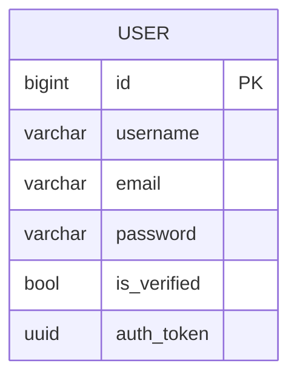
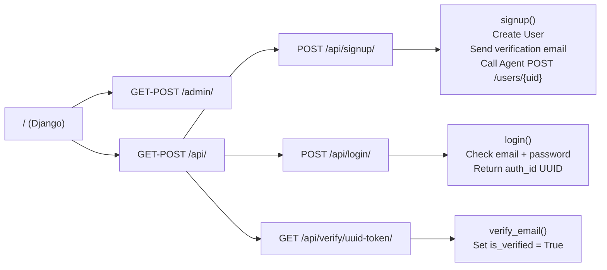
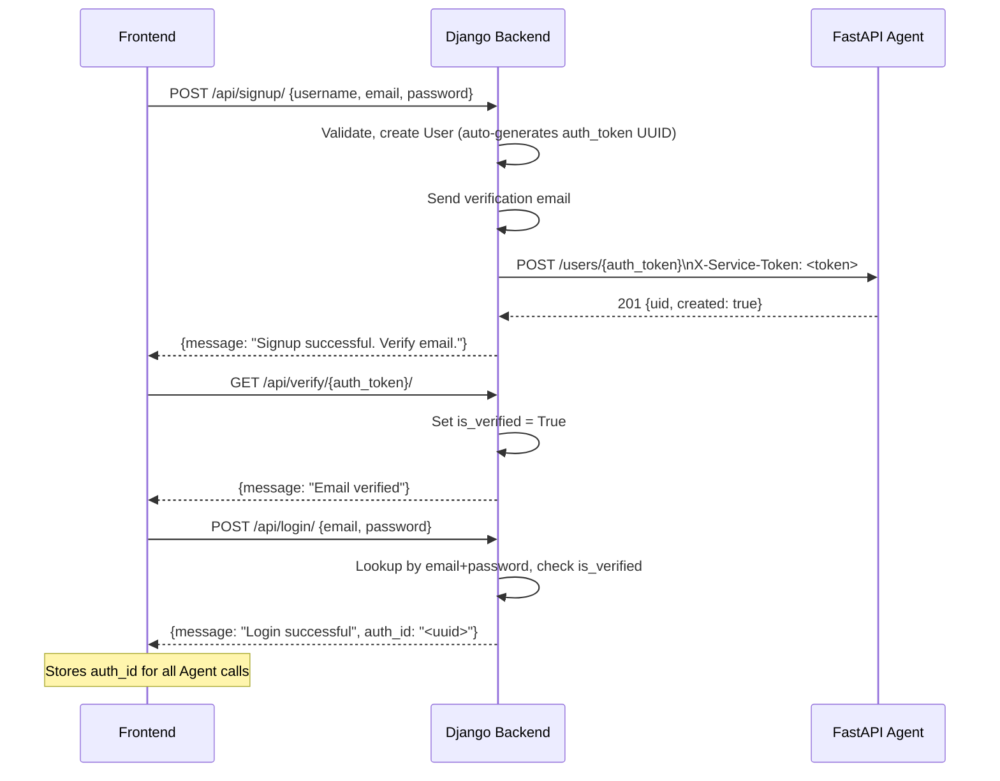

# 🖥️ Kairos — Backend

> Django 5.2 + Django REST Framework authentication backend — the identity authority for the Kairos platform.

---

## 📋 Table of Contents

1. [Overview](#-overview)
2. [Folder Structure](#-folder-structure)
3. [Setup & Installation](#-setup--installation)
4. [Key Components](#-key-components)
   - [beyondstars_backend/ — Project Package](#beyondstars_backend--project-package)
   - [core/ — Application Package](#core--application-package)
5. [API Reference](#-api-reference)
6. [Mermaid Diagrams](#-mermaid-diagrams)
7. [Configuration](#-configuration)
8. [Testing](#-testing)
9. [Known Issues / TODOs](#-known-issues--todos)

---

## 📚 Documentation Index

| Document | Description |
|----------|-------------|
| [Backend/docs/ARCHITECTURE.md](docs/ARCHITECTURE.md) | Django module graph, middleware lifecycle, component breakdown |
| [Backend/docs/SETUP.md](docs/SETUP.md) | Installation, manage.py commands, migration steps |
| [Backend/docs/API.md](docs/API.md) | All endpoints, request/response schemas, integration contract |
| [Backend/docs/DATABASE.md](docs/DATABASE.md) | ER diagram, field tables, indexing, migration history |
| [Backend/docs/SUMMARY.md](docs/SUMMARY.md) | Module summary, integration points, known issues |

---

## 🧭 Overview

The Kairos Backend is a Django 5.2 REST API responsible for user identity management across the entire platform. It handles the three core authentication operations — registration, email verification, and login — and synchronises user lifecycle events to the Agent via the internal service API.

The Backend is deliberately lightweight. It does not own restaurant data, preferences, interaction history, or AI logic — all of that belongs to the Agent. Its single responsibility is: verifying that a human with a valid email address is who they claim to be, and issuing a stable UUID (`auth_token`) that uniquely identifies them across both the Backend and Agent systems.

The `auth_token` UUID is generated once at registration and never regenerated. It serves as both the Backend session identifier and the `X-User-ID` header value that the Frontend passes to the Agent for all AI requests.

---

## 🗂️ Folder Structure

```
Backend/
├── manage.py                        ← Django management entry point
├── db.sqlite3                       ← SQLite database (development only)
├── Readme.md                        ← (original empty file)
├── README.md                        ← This file
├── AGENT_INTEGRATION_REPORT.md      ← Complete Backend ↔ Agent integration guide
├── beyondstars_backend/
│   ├── __init__.py
│   ├── settings.py                  ← Django project settings
│   ├── urls.py                      ← Root URL dispatcher (admin/ + api/)
│   ├── asgi.py                      ← ASGI entry point (for async servers)
│   └── wsgi.py                      ← WSGI entry point (for Gunicorn/uWSGI)
└── core/
    ├── __init__.py
    ├── models.py                    ← User model (username, email, password, auth_token)
    ├── views.py                     ← signup, login, verify_email views
    ├── serializers.py               ← UserSerializer
    ├── urls.py                      ← /signup/, /login/, /verify/<token>/
    ├── admin.py                     ← Django admin registration
    ├── apps.py                      ← CoreConfig app config
    ├── tests.py                     ← Test file (currently empty)
    └── migrations/
        ├── 0001_initial.py          ← Initial User model migration
        └── 0002_rename_...py        ← Rename verification_token to auth_token
```

---

## ⚙️ Setup & Installation

### 1. Create and activate a virtual environment

```bash
cd Backend
python3 -m venv .venv
source .venv/bin/activate
```

### 2. Install dependencies

```bash
pip install django djangorestframework
# Or install from a requirements file if added in future:
# pip install -r requirements.txt
```

### 3. Apply database migrations

```bash
python manage.py migrate
```

### 4. Create a superuser (optional — for Django Admin)

```bash
python manage.py createsuperuser
```

### 5. Start the development server

```bash
python manage.py runserver 8000
```

The API is now available at `http://localhost:8000/api/`.

---

## 🔑 Key Components

### `beyondstars_backend/` — Project Package

#### `settings.py`

Django project configuration loaded at startup.

| Setting | Value | Notes |
|---------|-------|-------|
| `SECRET_KEY` | Insecure default | **Must be replaced with env var before production** |
| `DEBUG` | `True` | **Must be `False` in production** |
| `ALLOWED_HOSTS` | `[]` | **Must be populated in production** |
| `INSTALLED_APPS` | Includes `rest_framework`, `core` | DRF and the core auth app |
| `DATABASES` | SQLite3 at `BASE_DIR/db.sqlite3` | **Must be replaced with PostgreSQL in production** |
| `DEFAULT_AUTO_FIELD` | `BigAutoField` | All PK fields are BigInteger |
| `EMAIL_BACKEND` | SMTP | SMTP host `localhost`, port `2525`, TLS off |

> ⚠️ **Warning:** The current `SECRET_KEY` is hardcoded and publicly visible. This **must** be loaded from an environment variable (`os.environ['DJANGO_SECRET_KEY']`) before any deployment.

#### `urls.py`

Root URL dispatcher. Delegates all `/api/` paths to `core.urls` and exposes the Django Admin at `/admin/`.

```python
urlpatterns = [
    path('admin/', admin.site.urls),
    path('api/', include('core.urls')),
]
```

#### `asgi.py` / `wsgi.py`

Standard Django entry points. Use `asgi.py` with an async server (Daphne, Uvicorn) or `wsgi.py` with a synchronous server (Gunicorn, uWSGI).

---

### `core/` — Application Package

#### `models.py` — `User`

The single ORM model. Stores user credentials and the identity token bridging the Backend and Agent.

```python
class User(models.Model):
    username    = models.CharField(max_length=100)
    email       = models.EmailField(unique=True)
    password    = models.CharField(max_length=100)  # ⚠️ PLAINTEXT — must be hashed
    is_verified = models.BooleanField(default=False)
    auth_token  = models.UUIDField(default=uuid.uuid4, editable=False)
```

| Field | Type | Description |
|-------|------|-------------|
| `id` | `BigAutoField` PK | Auto-increment primary key |
| `username` | `CharField(100)` | Display name |
| `email` | `EmailField` (unique) | Primary identity — must be verified before login |
| `password` | `CharField(100)` | **Currently plaintext — must use `make_password`/`check_password`** |
| `is_verified` | `BooleanField` | Set to `True` when the user clicks the email verification link |
| `auth_token` | `UUIDField` | UUID v4, generated once at creation, never changed. This is the `uid` used everywhere in the Agent. |

> ⚠️ **Warning:** Passwords are stored in plaintext. Use Django's `make_password()` to hash on save and `check_password()` to verify on login before this goes to production.

#### `serializers.py` — `UserSerializer`

A minimal `ModelSerializer` that exposes all `User` fields.

```python
class UserSerializer(serializers.ModelSerializer):
    class Meta:
        model = User
        fields = '__all__'
```

> ⚠️ **Warning:** `fields = '__all__'` exposes the `password` field in API responses. In production, explicitly list only safe fields and use a `write_only=True` password field.

#### `views.py` — API Views

Three function-based views decorated with `@api_view`.

**`signup(request)` — `POST /api/signup/`**

1. Validates the incoming `UserSerializer`
2. Saves the user (creates `auth_token` UUID automatically)
3. Sends a verification email to the user's email address containing a link: `http://127.0.0.1:8000/api/verify/{auth_token}/`
4. Returns `{"message": "Signup successful. Verify email."}`

After saving the user, the Backend **must also** call the Agent's `POST /users/{auth_token}` endpoint with the `X-Service-Token` header to create a matching user record in the Agent's PostgreSQL database. See [AGENT_INTEGRATION_REPORT.md](AGENT_INTEGRATION_REPORT.md) for the complete hook implementation.

**`verify_email(request, token)` — `GET /api/verify/<uuid:token>/`**

1. Looks up the user by `auth_token`
2. Sets `is_verified = True` and saves
3. Returns `{"message": "Email verified"}` or `{"message": "Invalid token"}` on failure

**`login(request)` — `POST /api/login/`**

1. Looks up the user by `email` and `password`
2. Returns `{"message": "Please verify your email first"}` if `is_verified` is False
3. Returns `{"message": "Login successful", "auth_id": "<auth_token>"}` on success

The `auth_id` in the login response is the user's `auth_token` UUID. The Frontend stores this value and passes it as the `X-User-ID` header on all Agent API requests.

#### `urls.py` — API URL Patterns

```python
urlpatterns = [
    path('signup/',             signup),
    path('login/',              login),
    path('verify/<uuid:token>/', verify_email),
]
```

All routes are mounted under `/api/` by the root `beyondstars_backend/urls.py`.

---

## 📡 API Reference

**Base URL (development):** `http://localhost:8000`

| Method | Path | Auth | Request Body | Response |
|--------|------|------|-------------|----------|
| `POST` | `/api/signup/` | None | `{username, email, password}` | `{message}` |
| `POST` | `/api/login/` | None | `{email, password}` | `{message, auth_id}` |
| `GET` | `/api/verify/<token>/` | None | — | `{message}` |
| `*` | `/admin/` | Django session | — | Django Admin UI |

### `POST /api/signup/`

```bash
curl -X POST http://localhost:8000/api/signup/ \
  -H "Content-Type: application/json" \
  -d '{"username": "johndoe", "email": "john@example.com", "password": "secret123"}'
```

**Success response:**
```json
{"message": "Signup successful. Verify email."}
```

**Validation error response:**
```json
{"email": ["user with this email already exists."]}
```

### `POST /api/login/`

```bash
curl -X POST http://localhost:8000/api/login/ \
  -H "Content-Type: application/json" \
  -d '{"email": "john@example.com", "password": "secret123"}'
```

**Success response:**
```json
{"message": "Login successful", "auth_id": "550e8400-e29b-41d4-a716-446655440000"}
```

**Unverified response:**
```json
{"message": "Please verify your email first"}
```

### `GET /api/verify/<token>/`

```bash
curl http://localhost:8000/api/verify/550e8400-e29b-41d4-a716-446655440000/
```

**Success response:**
```json
{"message": "Email verified"}
```

---

## 🔷 Mermaid Diagrams

### ER Diagram



### API Route Map



### Backend ↔ Agent Synchronisation Flow



---

## ⚙️ Configuration

The Backend is configured entirely via `beyondstars_backend/settings.py`. Key settings that need to be environment-driven before production:

| Setting | Current Value | Production Requirement |
|---------|--------------|----------------------|
| `SECRET_KEY` | Hardcoded insecure key | Load from `os.environ['DJANGO_SECRET_KEY']` |
| `DEBUG` | `True` | `False` |
| `ALLOWED_HOSTS` | `[]` | List of production domain names |
| `DATABASES` | SQLite3 | PostgreSQL (same instance as Agent or separate) |
| `EMAIL_HOST` | `localhost` | Production SMTP host (SendGrid, SES, etc.) |
| `EMAIL_PORT` | `2525` | `587` (TLS) in production |
| `EMAIL_USE_TLS` | `False` | `True` |
| Verification URL | `http://127.0.0.1:8000/...` | Replace with production domain |

The Agent integration requires two additional settings:

```python
# Add to settings.py
AGENT_BASE_URL = os.environ.get('AGENT_BASE_URL', 'http://localhost:4021')
AGENT_SERVICE_TOKEN = os.environ['AGENT_SERVICE_TOKEN']
```

---

## 🧪 Testing

```bash
cd Backend
source .venv/bin/activate

# Run the Django test suite
python manage.py test core

# Test signup manually
curl -X POST http://localhost:8000/api/signup/ \
  -H "Content-Type: application/json" \
  -d '{"username": "test", "email": "test@example.com", "password": "test123"}'

# Test login
curl -X POST http://localhost:8000/api/login/ \
  -H "Content-Type: application/json" \
  -d '{"email": "test@example.com", "password": "test123"}'
```

---

## 🐛 Known Issues / TODOs

| Issue | Severity | Recommended Fix |
|-------|----------|----------------|
| Passwords stored in plaintext | **Critical** | Use `make_password()` / `check_password()` from `django.contrib.auth.hashers` |
| `SECRET_KEY` hardcoded in source | **Critical** | Load from environment variable |
| `DEBUG = True` hardcoded | High | Load from environment variable; default `False` |
| SQLite database (no concurrency) | High | Migrate to PostgreSQL for production |
| No Agent sync hook in `signup` view | High | Implement `POST /users/{uid}` Agent call after user creation (see `AGENT_INTEGRATION_REPORT.md`) |
| Verification URL uses `127.0.0.1:8000` (hardcoded) | Medium | Load from `settings.SITE_URL` environment variable |
| `UserSerializer` exposes all fields including `password` | Medium | Use explicit field list with `write_only=True` for password |
| `core/tests.py` is empty | Low | Add test cases for signup, login, verify, and Agent sync |
| No CORS configuration | Medium | Add `django-cors-headers` for cross-origin Frontend requests |
| No rate limiting | Medium | Add `django-ratelimit` to prevent brute-force login attempts |
