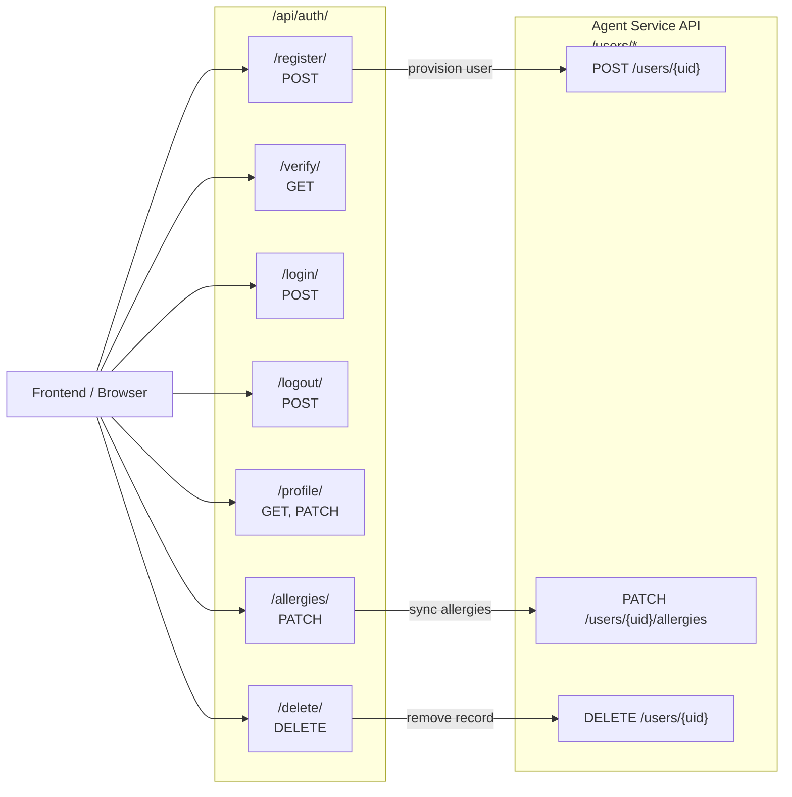

# Backend API Reference — Kairos · Beyond Stars

This document provides the complete HTTP endpoint reference for the Kairos Django Backend, including the integration contract between the Backend and the FastAPI Agent for user lifecycle synchronisation.

---

## 📋 Table of Contents

1. [Base URL and Authentication](#1-base-url-and-authentication)
2. [Authentication Endpoints](#2-authentication-endpoints)
   - [POST /register/](#21-post-register)
   - [GET /verify/](#22-get-verify)
   - [POST /login/](#23-post-login)
   - [POST /logout/](#24-post-logout)
   - [GET /profile/](#25-get-profile)
   - [PATCH /profile/](#26-patch-profile)
   - [DELETE /delete/](#27-delete-delete)
   - [PATCH /allergies/](#28-patch-allergies)
3. [Backend → Agent Service API Contract](#3-backend--agent-service-api-contract)
4. [Error Response Format](#4-error-response-format)
5. [API Route Graph](#5-api-route-graph)
6. [Related Documents](#related-documents)

---

## 1. Base URL and Authentication

| Environment | Base URL |
|-------------|----------|
| Local development | `http://localhost:8000/api/auth` |
| Production | `https://beyondstars.gokulp.online/api/auth` |

**Client authentication:** The Backend does not use JWT or sessions. After login, the Backend returns the user's `auth_token` UUID. The client stores this and passes it as the `X-Auth-Token` header (or query parameter) on authenticated requests.

> ℹ️ **Note:** The `auth_token` returned by `/login/` is the same value used as `X-User-ID` when calling the Agent directly from the Frontend.

---

## 2. Authentication Endpoints

### 2.1 `POST /register/`

Registers a new user, sends a verification email, and (when wired) provisions the user record in the Agent database.

**Request Body:**

```json
{
  "username": "string",
  "email": "string (valid email address)",
  "password": "string (min 8 characters)"
}
```

**Response `201 Created`:**

```json
{
  "message": "Verification email sent. Please verify your account."
}
```

**Error Responses:**

| Status | Condition |
|--------|-----------|
| `400` | Username or email already registered |
| `400` | Password shorter than 8 characters |
| `400` | Invalid email format |

**Side effects:**
- Creates a `core_user` record with `is_verified=False` and a new `auth_token` UUID
- Sends a verification email to the provided address via SMTP
- Calls Agent `POST /users/{auth_token}` with `{"email": "..."}` (when integrated)

**Example:**

```bash
curl -X POST http://localhost:8000/api/auth/register/ \
  -H "Content-Type: application/json" \
  -d '{"username": "alice", "email": "alice@example.com", "password": "securepass123"}'
```

---

### 2.2 `GET /verify/`

Verifies a user's email address by setting `is_verified=True`.

**Query Parameters:**

| Parameter | Type | Required | Description |
|-----------|------|----------|-------------|
| `token` | `string (UUID)` | ✅ | The `auth_token` from the verification email link |

**Response `200 OK`:**

```json
{
  "message": "Email verified successfully."
}
```

**Error Responses:**

| Status | Condition |
|--------|-----------|
| `400` | Token not provided |
| `404` | No user found with that auth_token |
| `400` | User already verified |

**Example:**

```bash
curl "http://localhost:8000/api/auth/verify/?token=550e8400-e29b-41d4-a716-446655440000"
```

---

### 2.3 `POST /login/`

Authenticates a user with email and password. Returns the `auth_token` UUID for use in subsequent requests.

**Request Body:**

```json
{
  "email": "string",
  "password": "string"
}
```

**Response `200 OK`:**

```json
{
  "auth_id": "550e8400-e29b-41d4-a716-446655440000"
}
```

The `auth_id` value is the user's `auth_token`. The Frontend must store this value and use it as `X-User-ID` when calling the Agent.

**Error Responses:**

| Status | Condition |
|--------|-----------|
| `400` | Email or password missing |
| `401` | Email/password combination not found |
| `403` | User exists but `is_verified = False` |

**Example:**

```bash
curl -X POST http://localhost:8000/api/auth/login/ \
  -H "Content-Type: application/json" \
  -d '{"email": "alice@example.com", "password": "securepass123"}'
```

---

### 2.4 `POST /logout/`

Stateless logout stub. Since the Backend does not maintain server-side sessions, this endpoint simply confirms receipt. The client must discard the stored `auth_token`.

**Response `200 OK`:**

```json
{
  "message": "Logged out successfully."
}
```

---

### 2.5 `GET /profile/`

Returns the authenticated user's profile data.

**Required Header:** `X-Auth-Token: <auth_token>`

**Response `200 OK`:**

```json
{
  "id": 1,
  "username": "alice",
  "email": "alice@example.com",
  "is_verified": true,
  "auth_token": "550e8400-e29b-41d4-a716-446655440000",
  "created_at": "2025-01-15T10:30:00Z"
}
```

**Error Responses:**

| Status | Condition |
|--------|-----------|
| `401` | Missing or invalid `X-Auth-Token` |

---

### 2.6 `PATCH /profile/`

Updates the authenticated user's profile fields.

**Required Header:** `X-Auth-Token: <auth_token>`

**Request Body (all fields optional):**

```json
{
  "username": "new_username"
}
```

**Response `200 OK`:** Updated profile object (same structure as GET response).

---

### 2.7 `DELETE /delete/`

Permanently deletes the user's account from both the Backend and the Agent.

**Required Header:** `X-Auth-Token: <auth_token>`

**Response `200 OK`:**

```json
{
  "message": "Account deleted successfully."
}
```

**Side effects:**
- Deletes the `core_user` record from Django's database
- Calls Agent `DELETE /users/{auth_token}` (CASCADE deletes all interactions in PostgreSQL)

---

### 2.8 `PATCH /allergies/`

Updates the user's confirmed allergies and severity levels. The Backend validates the request and syncs to the Agent.

**Required Header:** `X-Auth-Token: <auth_token>`

**Request Body:**

```json
{
  "confirmed": ["peanuts", "dairy", "gluten"],
  "severity": {
    "peanuts": "anaphylactic",
    "dairy": "moderate",
    "gluten": "intolerance"
  }
}
```

**Valid severity values:** `anaphylactic` | `severe` | `moderate` | `intolerance`

**Response `200 OK`:**

```json
{
  "message": "Allergies updated successfully."
}
```

**Error Responses:**

| Status | Condition |
|--------|-----------|
| `400` | `severity` values are not valid severity strings |
| `400` | Allergen in `severity` not in `confirmed` list |
| `401` | Missing or invalid `X-Auth-Token` |

**Side effects:**
- Calls Agent `PATCH /users/{auth_token}/allergies` with the same payload
- Agent normalises allergen names against `CANONICAL_ALLERGENS` and `ALLERGEN_SYNONYMS`

---

## 3. Backend → Agent Service API Contract

The Backend calls the Agent's `/users/*` endpoints using the `X-Service-Token` header. These calls are not accessible from the Frontend.

| Backend Action | Agent Endpoint | Method | Auth Header | Request Body |
|---------------|---------------|--------|-------------|-------------|
| User registration | `/users/{auth_token}` | `POST` | `X-Service-Token` | `{"email": "..."}` |
| Allergy update | `/users/{auth_token}/allergies` | `PATCH` | `X-Service-Token` | `{"confirmed": [...], "severity": {...}}` |
| Account deletion | `/users/{auth_token}` | `DELETE` | `X-Service-Token` | None |

**Agent Base URL (from Backend config):**
- Development: `http://localhost:4021`
- Production: `https://kairos-t1.gokulp.online`

---

## 4. Error Response Format

All error responses follow this standard structure:

```json
{
  "error": "Human-readable error description.",
  "code": "ERROR_CODE_IDENTIFIER"
}
```

**Common error codes:**

| Code | HTTP Status | Meaning |
|------|-------------|---------|
| `EMAIL_ALREADY_EXISTS` | 400 | Email is already registered |
| `USERNAME_ALREADY_EXISTS` | 400 | Username is already taken |
| `INVALID_CREDENTIALS` | 401 | Wrong email or password |
| `EMAIL_NOT_VERIFIED` | 403 | `is_verified = False`; check email for verification link |
| `INVALID_TOKEN` | 401 | `X-Auth-Token` header value not found |
| `USER_NOT_FOUND` | 404 | No user with the given identifier |
| `AGENT_SYNC_FAILED` | 503 | Backend failed to sync the operation to the Agent |

---

## 5. API Route Graph



---

## Related Documents

- [Backend/README.md](../README.md) — Backend entry point
- [Backend/docs/ARCHITECTURE.md](ARCHITECTURE.md) — Component and lifecycle reference
- [Backend/docs/DATABASE.md](DATABASE.md) — Schema and migrations
- [Backend/docs/SUMMARY.md](SUMMARY.md) — Module summary
- [docs/API.md](../../docs/API.md) — Full cross-system API reference
