# Backend Architecture — Kairos · Beyond Stars

This document provides the complete architectural reference for the Kairos Django Backend — the identity authority for the platform. It covers the Django module structure, middleware lifecycle, the core application components, and the Backend's integration contracts with both the Agent and the Frontend.

---

## 📋 Table of Contents

1. [Backend Overview](#1-backend-overview)
2. [Django Module Graph](#2-django-module-graph)
3. [Core App Components](#3-core-app-components)
4. [Middleware Lifecycle](#4-middleware-lifecycle)
5. [Backend ↔ Agent Integration](#5-backend--agent-integration)
6. [Authentication Flow](#6-authentication-flow)
7. [Related Documents](#related-documents)

---

## 1. Backend Overview

The Kairos Backend is a deliberately single-purpose Django 5.2 REST API. Its sole responsibility is user identity management: registering users, verifying their email addresses, and issuing the stable `auth_token` UUID that uniquely identifies a user across the entire platform. It does not own restaurant data, preferences, or AI logic.

The Backend acts as the entry point for new users. When a user registers, the Backend creates a local Django user object and simultaneously provisions a corresponding record in the Agent's PostgreSQL database by calling `POST /users/{auth_token}`. This ensures the Agent is always pre-loaded with a user record before the Frontend makes any AI requests. The `auth_token` field serves double duty: it is the Backend's session credential and the Agent's `uid` foreign key.

The simplicity of the Backend is intentional. Adding new features should default to the Agent (for AI/data features) or the Frontend (for UI features). The Backend should only grow when a new user identity concern arises.

---

## 2. Django Module Graph

```mermaid
graph TD
    subgraph DjangoProject["beyondstars_backend/ (Project Package)"]
        SETTINGS["settings.py\nDEBUG, INSTALLED_APPS,\nDATABASES, EMAIL_BACKEND,\nMIDDLEWARE, AUTH_USER_MODEL"]
        URLS_ROOT["urls.py\nurlpatterns → /api/auth/"]
        WSGI["wsgi.py\nWSGI entry point"]
        ASGI["asgi.py\nASGI entry point"]
    end

    subgraph CoreApp["core/ (Application Package)"]
        MODELS["models.py\nUser(AbstractBaseUser)\nid, username, email, password,\nis_verified, auth_token UUID4"]
        VIEWS["views.py\nRegisterView, VerifyEmailView,\nLoginView, LogoutView,\nProfileView, DeleteUserView,\nAllergyUpdateView"]
        SERIALIZERS["serializers.py\nUserSerializer,\nRegisterSerializer,\nLoginSerializer,\nAllergyUpdateSerializer"]
        URLS_CORE["urls.py\nRoute mapping\n/register/, /verify/, /login/,\n/logout/, /profile/, /delete/,\n/allergies/"]
        ADMIN["admin.py\nUserAdmin\nregistered with custom display"]
        MIGRATIONS["migrations/\n0001_initial (User+auth_token)\n0002_rename_token_field"]
    end

    URLS_ROOT --> URLS_CORE
    URLS_CORE --> VIEWS
    VIEWS --> MODELS
    VIEWS --> SERIALIZERS
    MODELS --> MIGRATIONS
    SETTINGS --> MODELS
    SETTINGS --> URLS_ROOT

    subgraph ExternalCalls["External Calls from views.py"]
        AGENT["FastAPI Agent\nPOST /users/{uid}\nPATCH /users/{uid}/allergies\nDELETE /users/{uid}"]
        SMTP["SMTP Server\nport 2525 (Mailhog for dev)\nVerification email"]
    end

    VIEWS --> AGENT
    VIEWS --> SMTP
```



---

## 3. Core App Components

### `core/models.py` — User Model

The Backend uses a custom `User` model that extends `AbstractBaseUser`, allowing full control over all fields including the authentication token.

| Field | Type | Constraints | Purpose |
|-------|------|-------------|---------|
| `id` | `AutoField` | PK | Internal SQLite/PostgreSQL row ID |
| `username` | `CharField(max_length=150)` | `unique=True` | User's chosen display name |
| `email` | `EmailField(max_length=254)` | `unique=True` | Authentication lookup key |
| `password` | `CharField(max_length=128)` | — | ⚠️ Currently stored in **plaintext** |
| `is_verified` | `BooleanField` | `default=False` | Email verification gate; must be `True` to login |
| `auth_token` | `UUIDField` | `default=uuid.uuid4, unique=True, editable=False` | Cross-service user identity; immutable after creation |
| `created_at` | `DateTimeField` | `auto_now_add=True` | Audit timestamp |

> 🔴 **Critical Security Issue:** Passwords are stored in plaintext. Before production, replace with `make_password()` from `django.contrib.auth.hashers` during registration and `check_password()` during login.

### `core/serializers.py` — Data Validation

| Serializer | `Meta.model` | Key Validation |
|------------|-------------|---------------|
| `RegisterSerializer` | `User` | Validates unique `email`, unique `username`, `password` length >= 8 |
| `LoginSerializer` | `User` | Field presence validation only (auth logic in view) |
| `AllergyUpdateSerializer` | — | Validates `confirmed` is `list[str]`, `severity` is `dict[str, str]` where values ∈ `SEVERITY_LEVELS` |
| `UserSerializer` | `User` | Full read-only profile serialiser (excludes `password`) |

### `core/views.py` — View Functions

| View Class | HTTP Methods | Route | Purpose |
|-----------|-------------|-------|---------|
| `RegisterView` | `POST` | `/api/auth/register/` | Creates user, sends verification email, calls Agent `POST /users/{auth_token}` |
| `VerifyEmailView` | `GET` | `/api/auth/verify/?token=<auth_token>` | Sets `is_verified=True` |
| `LoginView` | `POST` | `/api/auth/login/` | Validates credentials, returns `{"auth_id": auth_token}` |
| `LogoutView` | `POST` | `/api/auth/logout/` | Stub (stateless API, client discards token) |
| `ProfileView` | `GET, PATCH` | `/api/auth/profile/` | Read or update user profile |
| `DeleteUserView` | `DELETE` | `/api/auth/delete/` | Deletes Django user, calls Agent `DELETE /users/{uid}` |
| `AllergyUpdateView` | `PATCH` | `/api/auth/allergies/` | Updates allergy data, calls Agent `PATCH /users/{uid}/allergies` |

### `core/urls.py` — URL Routing

```python
urlpatterns = [
    path("register/",    RegisterView.as_view()),
    path("verify/",      VerifyEmailView.as_view()),
    path("login/",       LoginView.as_view()),
    path("logout/",      LogoutView.as_view()),
    path("profile/",     ProfileView.as_view()),
    path("delete/",      DeleteUserView.as_view()),
    path("allergies/",   AllergyUpdateView.as_view()),
]
```

All routes are mounted at `/api/auth/` via `beyondstars_backend/urls.py`.

### `core/admin.py` — Django Admin

`UserAdmin` is registered with a custom `list_display` showing `username`, `email`, `is_verified`, `auth_token`, and `created_at`. The admin panel is accessible at `/admin/` when `DEBUG=True`.

---

## 4. Middleware Lifecycle

Each HTTP request passes through Django's middleware stack in order. The following shows the relevant middleware configured for this project:


> ℹ️ **Note:** This project uses stateless REST endpoints. Django session and auth middleware are included by default but not actively used in the API views — authentication is handled by the `auth_token` UUID system, not Django sessions.

---

## 5. Backend ↔ Agent Integration

The Backend is responsible for keeping the Agent in sync with user lifecycle events. All Agent API calls are made synchronously (using `requests` or `httpx`) within the Django view before the response is returned to the Frontend.

```mermaid
sequenceDiagram
    participant FE as Frontend
    participant BE as Django Backend
    participant AG as FastAPI Agent

    Note over FE,AG: ── Registration ──
    FE->>BE: POST /api/auth/register/\n{"username":"...","email":"...","password":"..."}
    BE->>BE: Validate + Save User (auto-generates auth_token UUID)
    BE->>BE: Send verification email via SMTP
    BE->>AG: POST /users/{auth_token}\nX-Service-Token: <token>\n{"email":"..."}
    AG-->>BE: 201 {"uid":"...", "created":true}
    BE-->>FE: 201 {"message": "Verification email sent"}

    Note over FE,AG: ── Allergy Update ──
    FE->>BE: PATCH /api/auth/allergies/\nX-Auth-Token: <auth_token>\n{"confirmed":["peanuts"],"severity":{...}}
    BE->>BE: Validate with AllergyUpdateSerializer
    BE->>AG: PATCH /users/{auth_token}/allergies\nX-Service-Token: <token>\n{...}
    AG-->>BE: 200 {"uid":"...","updated":true}
    BE-->>FE: 200 {"message": "Allergies updated"}

    Note over FE,AG: ── Account Deletion ──
    FE->>BE: DELETE /api/auth/delete/\nX-Auth-Token: <auth_token>
    BE->>AG: DELETE /users/{auth_token}\nX-Service-Token: <token>
    AG-->>BE: 204 No Content
    BE->>BE: User.objects.filter(auth_token=...).delete()
    BE-->>FE: 200 {"message": "Account deleted"}
```



### Agent Sync — Current Implementation Status

| Lifecycle Event | Agent Call | Status |
|----------------|-----------|--------|
| User registration → provision Agent record | `POST /users/{auth_token}` | ⚠️ Documented but **not fully confirmed** in current code |
| Email verified → none | — | N/A |
| Allergy update → sync to Agent | `PATCH /users/{auth_token}/allergies` | ⚠️ Documented |
| Account deletion → remove Agent record | `DELETE /users/{auth_token}` | ⚠️ Documented |

> ⚠️ **Warning:** Per `AGENT_INTEGRATION_REPORT.md`, the Backend↔Agent sync calls are specified but may not be fully wired in the current codebase. Verify each Django view manually and add missing `httpx` calls if absent.

---

## 6. Authentication Flow

The Backend uses a simple token-based flow without JWT. The `auth_token` UUID is permanent (never regenerates).


---

## Related Documents

- [Backend/README.md](../README.md) — Backend module entry point
- [Backend/docs/SETUP.md](SETUP.md) — Backend installation and configuration
- [Backend/docs/API.md](API.md) — Complete endpoint reference
- [Backend/docs/DATABASE.md](DATABASE.md) — Database schema and migrations
- [Backend/docs/SUMMARY.md](SUMMARY.md) — Module summary and roadmap
- [docs/ARCHITECTURE.md](../../docs/ARCHITECTURE.md) — Full system architecture
