# Backend Database Documentation — Kairos · Beyond Stars

This document provides the complete reference for the Django Backend database schema: the ER diagram, all field definitions with constraints, the indexing strategy, and the complete migration history.

---

## 📋 Table of Contents

1. [Entity Relationship Diagram](#1-entity-relationship-diagram)
2. [Table Definitions](#2-table-definitions)
   - [core_user](#21-core_user)
3. [Indexes and Constraints](#3-indexes-and-constraints)
4. [Migration History](#4-migration-history)
5. [Database Notes](#5-database-notes)
6. [Related Documents](#related-documents)

---

## 1. Entity Relationship Diagram

The Backend database is intentionally minimal. The Backend is the identity authority — it stores only what is needed to authenticate a user. All preference, interaction, and restaurant data lives in the Agent's PostgreSQL database.

```mermaid
erDiagram
    core_user {
        int id PK "AutoField, NOT NULL"
        varchar(150) username "UNIQUE, NOT NULL"
        varchar(254) email "UNIQUE, NOT NULL"
        varchar(128) password "NOT NULL (plaintext — security issue)"
        boolean is_verified "DEFAULT FALSE"
        uuid auth_token "UNIQUE, NOT NULL, editable=False, default=uuid4"
        datetime created_at "auto_now_add=True"
        datetime updated_at "auto_now=True"
    }
```



**Cardinality note:** There is only one table in the Backend database. All relational data (interactions with restaurants, preference history) is owned by the Agent using the `auth_token` UUID as the cross-database foreign key.

---

## 2. Table Definitions

### 2.1 `core_user`

The single entity in the Backend database. Represents a registered user with a stable cross-service identity token.

| Column | Type | Constraints | Description |
|--------|------|-------------|-------------|
| `id` | `INTEGER` | `PRIMARY KEY AUTOINCREMENT NOT NULL` | Internal Django row ID. Not used in cross-service communication. |
| `username` | `VARCHAR(150)` | `UNIQUE NOT NULL` | User's chosen display name. Enforced unique within the Backend only. |
| `email` | `VARCHAR(254)` | `UNIQUE NOT NULL` | Primary authentication lookup key. |
| `password` | `VARCHAR(128)` | `NOT NULL` | ⚠️ Currently stored in **plaintext**. Must be replaced with `django.contrib.auth.hashers.make_password()`. |
| `is_verified` | `BOOLEAN` | `NOT NULL DEFAULT 0` | Email verification gate. Login returns `403` until set to `1`. |
| `auth_token` | `CHAR(36)` (UUID) | `UNIQUE NOT NULL` | Immutable cross-service identifier. Generated once at registration via `uuid.uuid4`. Used as `uid` in the Agent's `users` table and as `X-User-ID` in Frontend API calls. |
| `created_at` | `DATETIME` | `NOT NULL` | Timestamp set automatically at row creation. |
| `updated_at` | `DATETIME` | `NOT NULL` | Timestamp updated automatically on every `save()`. |

**ORM Definition:**

```python
# core/models.py
class User(AbstractBaseUser):
    username   = models.CharField(max_length=150, unique=True)
    email      = models.EmailField(max_length=254, unique=True)
    password   = models.CharField(max_length=128)  # ⚠️ Plaintext
    is_verified = models.BooleanField(default=False)
    auth_token = models.UUIDField(
        default=uuid.uuid4,
        editable=False,
        unique=True
    )
    created_at = models.DateTimeField(auto_now_add=True)
    updated_at = models.DateTimeField(auto_now=True)

    USERNAME_FIELD  = "email"
    REQUIRED_FIELDS = ["username"]
```

---

## 3. Indexes and Constraints

| Index Name | Column(s) | Type | Purpose |
|-----------|-----------|------|---------|
| `core_user_pkey` | `id` | B-tree (auto) | Primary key lookup |
| `core_user_email_key` | `email` | B-tree (auto, UNIQUE) | Login lookup by email |
| `core_user_username_key` | `username` | B-tree (auto, UNIQUE) | Username uniqueness enforcement |
| `core_user_auth_token_key` | `auth_token` | B-tree (auto, UNIQUE) | Cross-service lookup by UUID + email verification |

All indexes are created automatically by Django migrations due to `unique=True` field constraints. No manual `db_index=True` is needed for the current access patterns.

**Common query patterns driving index usage:**

| Query | Index Used |
|-------|-----------|
| `User.objects.get(email=email)` | `core_user_email_key` |
| `User.objects.get(auth_token=token)` | `core_user_auth_token_key` |
| `User.objects.get(username=username)` | `core_user_username_key` |

---

## 4. Migration History

### `0001_initial.py`

**Created:** Initial project setup

**Changes:**
- Creates the `core_user` table with all fields
- Establishes `email` as `UNIQUE`
- Establishes `username` as `UNIQUE`
- Sets `auth_token` with `default=uuid.uuid4`, `unique=True`
- `is_verified = BooleanField(default=False)`

**Forwards:**
```sql
CREATE TABLE "core_user" (
    "id"           integer NOT NULL PRIMARY KEY AUTOINCREMENT,
    "username"     varchar(150) NOT NULL UNIQUE,
    "email"        varchar(254) NOT NULL UNIQUE,
    "password"     varchar(128) NOT NULL,
    "is_verified"  bool NOT NULL,
    "auth_token"   char(32) NOT NULL UNIQUE,
    "created_at"   datetime NOT NULL
);
```

---

### `0002_rename_verification_token_user_auth_token_and_more.py`

**Created:** Field rename refactor

**Changes:**
- Renames column `verification_token` → `auth_token` (the original field was named for email verification purposes; it was clarified that this token serves as the permanent cross-service identity)
- Adds any additional constraint adjustments noted in the migration file

This migration represents the key architectural decision that the `auth_token` field is not only for verification emails but is the permanent immutable identity token for the entire platform.

---

## 5. Database Notes

### Development vs Production

| Aspect | Development (current) | Production (recommended) |
|--------|----------------------|--------------------------|
| Engine | SQLite3 (`db.sqlite3`) | PostgreSQL 15+ |
| Location | `Backend/db.sqlite3` (in repo) | External managed database |
| Migrations | Automatic | Run `python manage.py migrate` in CI |
| Backups | Not needed (dev data) | Automated daily snapshots |

> ⚠️ **Warning:** `db.sqlite3` is currently tracked in git (not in `.gitignore`). This means development database changes appear as git diffs. Add `db.sqlite3` to `.gitignore` for cleanliness, or accept that it will appear in diffs for development convenience.

### Password Storage — Critical Security Issue

The current implementation stores passwords in plaintext. This is a P0 production blocker. The fix is:

```python
# In core/views.py — RegisterView
from django.contrib.auth.hashers import make_password, check_password

# On registration:
user.password = make_password(request.data["password"])
user.save()

# On login:
user = User.objects.get(email=email)
if not check_password(submitted_password, user.password):
    raise AuthenticationError
```

### Cross-Service Identity Design

The `auth_token` UUID is the cornerstone of cross-service identity. Its design constraints:

1. **Immutable:** Never regenerated after creation. Even if the user changes their email, `auth_token` stays the same.
2. **Unique globally:** `uuid4` generates a 128-bit random value — collision probability is negligible.
3. **Not a security secret:** The token is transmitted in email links and HTTP headers in plaintext. It is an identifier, not a cryptographic credential. For higher security, replace with short-lived JWTs.

---

## Related Documents

- [Backend/README.md](../README.md) — Backend module entry point
- [Backend/docs/ARCHITECTURE.md](ARCHITECTURE.md) — Django module graph and lifecycle
- [Backend/docs/API.md](API.md) — HTTP endpoint reference
- [Backend/docs/SUMMARY.md](SUMMARY.md) — Module summary and roadmap
