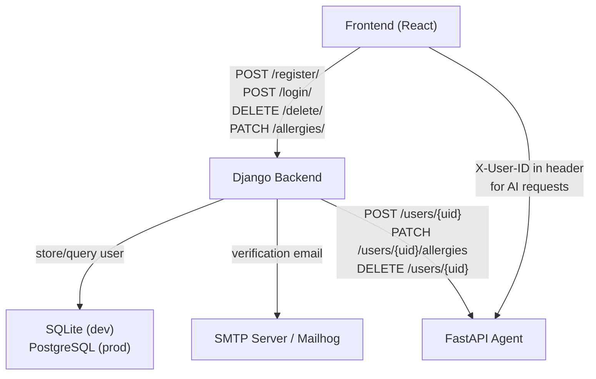

# Backend Summary — Kairos · Beyond Stars

This document summarises the Kairos Django Backend module: what it does, which parts of the platform it integrates with, known issues, and the improvement roadmap.

---

## 📋 Table of Contents

1. [Module Overview](#1-module-overview)
2. [Responsibilities](#2-responsibilities)
3. [Integration Points](#3-integration-points)
4. [Known Issues](#4-known-issues)
5. [Improvement Roadmap](#5-improvement-roadmap)
6. [Related Documents](#related-documents)

---

## 1. Module Overview

The Kairos Backend is a Django 5.2 REST API that serves as the platform's identity authority. In plain terms: it handles sign-up, email verification, and sign-in, and issues a UUID (`auth_token`) that establishes the user's identity for every other service in the stack. The Backend is the only service that verifies a human with a valid email address is who they claim to be.

The Backend is intentionally small. The codebase has one app (`core`), one model (`User`), seven endpoints, and no frontend-facing features beyond authentication. All restaurant data, AI features, and personalisation live in the Agent. This separation of concerns means the Backend can be maintained and deployed independently without affecting the AI layer.

---

## 2. Responsibilities

| Responsibility | Status |
|---------------|--------|
| User registration with email validation | ✅ Implemented |
| Email verification via verification link | ✅ Implemented |
| Login by email + password → issue `auth_token` | ✅ Implemented |
| Logout (stateless — client discards token) | ✅ Implemented |
| Profile read and update | ✅ Implemented |
| Account deletion | ✅ Implemented |
| Allergy data update with Agent sync | ✅ Implemented |
| Sync user lifecycle events to Agent database | ⚠️ Documented but verify integration in code |

---

## 3. Integration Points

**The auth_token bridge:** The `auth_token` UUID is the single shared identifier that connects the three services. The Backend issues it at registration. The Frontend stores it and uses it as `X-User-ID` in Agent requests. The Agent stores it as its `uid` primary key. This means no service needs to query another to look up a user ID — they all use the same UUID.

---

## 4. Known Issues

| Issue | Severity | Details |
|-------|----------|---------|
| Plaintext password storage | 🔴 Critical | `password` field is stored in plaintext. Must use `make_password()` / `check_password()` before production. |
| `SECRET_KEY` hardcoded in `settings.py` | 🔴 Critical | Django's secret key is hardcoded. Move to `os.environ['DJANGO_SECRET_KEY']`. If this key is exposed, all session-based security is compromised. |
| `DEBUG = True` in `settings.py` | 🔴 Critical | Must be `False` in production. `DEBUG=True` exposes stack traces and detailed error messages to the browser. |
| `ALLOWED_HOSTS = ["*"]` | 🟠 High | Allows requests from any hostname. Replace with specific domain(s) in production. |
| Backend → Agent sync calls not confirmed | 🟠 High | The `AGENT_INTEGRATION_REPORT.md` documents the sync contract, but the actual `requests`/`httpx` calls in `views.py` must be verified individually. |
| SQLite3 in production | 🟡 Medium | SQLite3 does not support concurrent writes well. Production deployments must use PostgreSQL. |
| `db.sqlite3` tracked in git | 🟡 Medium | The database file appears in `git diff`. Add to `.gitignore` or document that this is intentional for development. |
| No test coverage confirmed | 🟡 Medium | `tests.py` in `core/` exists but content is not confirmed to have meaningful test cases. |
| No rate limiting on auth endpoints | 🟡 Medium | `/login/` and `/register/` have no brute-force protection. Add `django-ratelimit` or a reverse proxy rule. |

---

## 5. Improvement Roadmap

### P0 — Before Production

| Item | Action |
|------|--------|
| Password hashing | Replace plaintext storage with `make_password()` / `check_password()` |
| Move `SECRET_KEY` to env | `SECRET_KEY = os.environ['DJANGO_SECRET_KEY']` |
| Set `DEBUG = False` | Control via env: `DEBUG = os.environ.get('DEBUG', 'False') == 'True'` |
| Restrict `ALLOWED_HOSTS` | Set to `["beyondstars.gokulp.online"]` for production |
| Confirm Agent sync calls | Verify `views.py` has `httpx` calls to `POST /users/{uid}`, `PATCH /users/{uid}/allergies`, `DELETE /users/{uid}` |
| PostgreSQL for production | Update `DATABASES` setting with PostgreSQL connection string |

### P1 — High Priority Security

| Item | Action |
|------|--------|
| Rate limiting | Add `django-ratelimit` to `/login/` and `/register/` (e.g., 5 attempts per 5 minutes per IP) |
| JWT tokens | Replace plain UUID token with signed JWT for better security and expiry control |
| Email link expiry | Set a time limit (e.g., 24 hours) on verification links using a separate `verification_token` field with `expires_at` timestamp |
| Password complexity validation | Add `validate_password()` from `django.contrib.auth.password_validation` |

### P2 — Medium Priority

| Item | Action |
|------|--------|
| Test suite | Write tests for all 7 endpoints covering happy paths + error cases in `core/tests.py` |
| Async Agent calls | Replace synchronous `requests` calls to Agent with async `httpx.AsyncClient` inside Django async views |
| Admin security | Restrict `/admin/` access by IP in production nginx config |
| Audit logging | Log all auth events (login, registration, deletion) with IP and timestamp |

### P3 — Nice to Have

| Item | Action |
|------|--------|
| OAuth support | Add Google OAuth sign-in as an alternative to email/password |
| Password reset flow | Implement `POST /forgot-password/` and `POST /reset-password/` endpoints |
| User preferences endpoint | Add `GET/PATCH /preferences/` so users can update cuisine preferences through the Backend (currently only possible via the Agent) |

---

## Related Documents

- [Backend/README.md](../README.md) — Backend module entry point
- [Backend/docs/ARCHITECTURE.md](ARCHITECTURE.md) — Django module graph
- [Backend/docs/SETUP.md](SETUP.md) — Installation and configuration
- [Backend/docs/API.md](API.md) — Endpoint reference
- [Backend/docs/DATABASE.md](DATABASE.md) — Schema and migrations
- [docs/SUMMARY.md](../../docs/SUMMARY.md) — Full project summary
