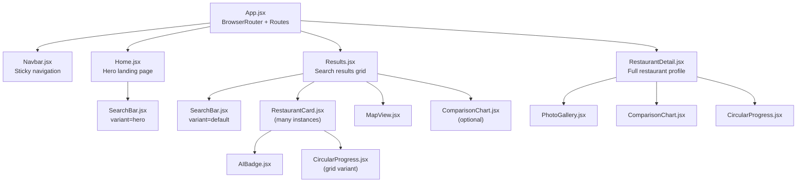
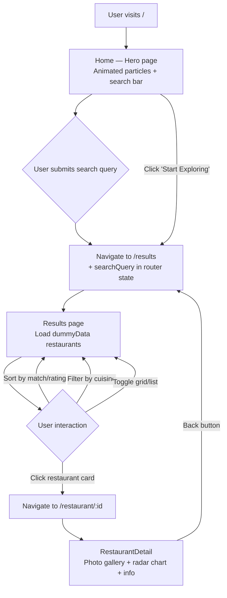
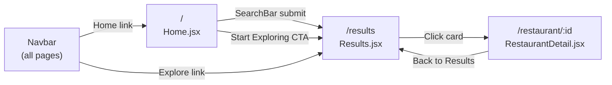

# 🎨 Kairos — Frontend

> React 19 + Vite SPA — the AI dining concierge interface for the Beyond Stars platform.

---

## 📋 Table of Contents

1. [Overview](#-overview)
2. [Folder Structure](#-folder-structure)
3. [Setup & Installation](#-setup--installation)
4. [Key Components](#-key-components)
   - [App.jsx — Root Component](#appjsx--root-component)
   - [Pages](#pages)
   - [Components](#components)
   - [Data Layer](#data-layer)
5. [API Integration](#-api-integration)
6. [Mermaid Diagrams](#-mermaid-diagrams)
7. [Configuration](#-configuration)
8. [Testing](#-testing)
9. [Known Issues / TODOs](#-known-issues--todos)

---

## 📚 Documentation Index

| Document | Description |
|----------|-------------|
| [Frontend/docs/ARCHITECTURE.md](docs/ARCHITECTURE.md) | Component hierarchy, routing, state management, Vite config |
| [Frontend/docs/SETUP.md](docs/SETUP.md) | Node.js setup, environment variables, build commands |
| [Frontend/docs/UI_UX.md](docs/UI_UX.md) | Design system, color palette, typography, user journey flows |
| [Frontend/docs/API.md](docs/API.md) | All API calls, auth token management, error/loading strategy |
| [Frontend/docs/COMPONENTS.md](docs/COMPONENTS.md) | Every component — props tables, usage examples |
| [Frontend/docs/SUMMARY.md](docs/SUMMARY.md) | Pages overview, UX highlights, known issues |

---

## 🧭 Overview

The Kairos Frontend is a single-page application built with React 19, Vite 7, and Tailwind CSS v4. It delivers the full "Beyond Stars" dining discovery experience: a hero landing page, AI-powered search, a filterable and sortable restaurant grid with a live map panel, radar-chart comparisons, and detailed restaurant pages with photo galleries.

The UI is designed around the Generative UI pattern — the Agent streams results back as Server-Sent Events, and the Frontend renders the appropriate UI component (restaurant list, map view, radar chart, or plain text) based on the `ui_type` field in the response payload. This allows the AI to decide what kind of visualisation best answers the user's query.

Currently, the UI layer is fully built and uses a rich dummy dataset (`dummyData.js`) for rapid development. All components are wired and ready to receive live data from the Agent's `POST /chat` and `GET /recommendations/{uid}` endpoints once the API integration is connected.

---

## 🗂️ Folder Structure

```
Frontend/
├── Readme.md                        ← (original empty file)
├── README.md                        ← This file
└── beyond-stars/
    ├── package.json                 ← Node.js dependencies and npm scripts
    ├── vite.config.js               ← Vite bundler configuration
    ├── tailwind.config.js           ← Tailwind CSS theme and content paths
    ├── postcss.config.js            ← PostCSS configuration for Tailwind
    ├── eslint.config.js             ← ESLint configuration
    ├── index.html                   ← HTML shell with #root mount point
    ├── PROJECT_SUMMARY.md           ← High-level project summary
    ├── README.md                    ← Vite default README
    └── src/
        ├── main.jsx                 ← React 19 entry point (createRoot)
        ├── App.jsx                  ← Root component with BrowserRouter + Routes
        ├── App.css                  ← Global app styles
        ├── index.css                ← Tailwind base/components/utilities import
        ├── assets/                  ← Static assets (images, SVGs)
        ├── components/
        │   ├── Navbar.jsx           ← Sticky navigation with mobile hamburger menu
        │   ├── SearchBar.jsx        ← AI-styled search with hero and default variants
        │   ├── RestaurantCard.jsx   ← Card with match score, image, cuisine tags
        │   ├── MapView.jsx          ← Interactive map panel (visual placeholder)
        │   ├── ComparisonChart.jsx  ← Recharts radar/bar comparison widget
        │   ├── CircularProgress.jsx ← Animated SVG circular score indicator
        │   ├── AIBadge.jsx          ← "AI Recommended" / "Top Match" badge
        │   └── PhotoGallery.jsx     ← Restaurant photo gallery carousel
        ├── pages/
        │   ├── Home.jsx             ← Hero landing page with animated particles
        │   ├── Results.jsx          ← Filterable, sortable restaurant grid + map
        │   └── RestaurantDetail.jsx ← Full restaurant detail with gallery + charts
        └── data/
            └── dummyData.js         ← Mock restaurant objects for UI development
```

---

## ⚙️ Setup & Installation

### Prerequisites

- Node.js 20+ and npm

### 1. Install dependencies

```bash
cd Frontend/beyond-stars
npm install
```

### 2. Start the development server

```bash
npm run dev
```

The app is available at `http://localhost:5173` (default Vite port).

### 3. Build for production

```bash
npm run build
# Preview the production build locally:
npm run preview
```

### Available Scripts

| Script | Command | Description |
|--------|---------|-------------|
| `dev` | `vite` | Start HMR development server |
| `build` | `vite build` | Bundle for production to `dist/` |
| `preview` | `vite preview` | Serve the `dist/` build locally |
| `lint` | `eslint .` | Run ESLint across all source files |

---

## 🔑 Key Components

### `App.jsx` — Root Component

Sets up the `BrowserRouter` and defines the three top-level routes. The `Navbar` is rendered outside the `Routes` so it persists across all pages.

```jsx
<Router>
  <div className="min-h-screen bg-gray-50">
    <Navbar />
    <Routes>
      <Route path="/"                element={<Home />} />
      <Route path="/results"         element={<Results />} />
      <Route path="/restaurant/:id"  element={<RestaurantDetail />} />
    </Routes>
  </div>
</Router>
```

---

### Pages

#### `pages/Home.jsx` — Hero Landing Page

The entry point of the application. Features an immersive full-screen hero section with a background restaurant photograph, an animated particle overlay, the main headline, and the AI search bar. Below the fold, a gradient CTA section drives users to the `/results` exploration page.

**Key UI elements:**
- Animated floating particles (`Math.random()` driven CSS animations)
- Platform stats display (10K+ restaurants, 98% match accuracy, 50K+ happy diners)
- Hero `SearchBar` (large variant, navigates to `/results` on submit)
- Gradient CTA with "Start Exploring" link

**Props:** None  
**Routing:** Navigates to `/results` via `SearchBar` and the CTA `Link`

---

#### `pages/Results.jsx` — Restaurant Discovery Grid

The main discovery interface. Displays a filterable, sortable list of restaurant cards alongside a sticky map panel. Receives an optional `searchQuery` from the previous page via `useLocation().state`.

**State:**

| State | Default | Description |
|-------|---------|-------------|
| `selectedRestaurant` | `null` | The restaurant whose card is currently hovered (used for map highlighting) |
| `sortBy` | `'match'` | Current sort criterion: `'match'` or `'rating'` |
| `filterCuisine` | `'all'` | Current cuisine filter |
| `viewMode` | `'grid'` | Card layout: `'grid'` (2-col) or `'list'` (1-col) |
| `showComparison` | `false` | Whether the `ComparisonChart` panel is visible |

**Features:**
- Sort by match score or star rating
- Filter by cuisine (dynamically derived from the data)
- Toggle between grid and list card layouts
- Show/hide the `ComparisonChart` comparison panel
- `MapView` panel (responsive — only visible on `lg` breakpoints)
- Hover state on cards highlights the corresponding map pin

---

#### `pages/RestaurantDetail.jsx` — Full Restaurant Detail

Displays the complete profile for a single restaurant. Looks up the restaurant by `:id` parameter from `dummyData.js`. 

**Features:**
- Full-width primary photo with thumbnail gallery strip
- AI Match Score badge with gradient colour coding (green → red)
- Star rating, review count, price range display
- Visual tags (cuisine, vibe, features)
- Action buttons (Reserve, Call Now, Get Directions, Share)
- `ComparisonChart` for performance radar (ambiance / service / food / value / location)
- `CircularProgress` score display
- Opening hours, address, and about sections

**Match score colour mapping:**

| Score | Gradient |
|-------|---------|
| ≥ 95 | `from-green-500 to-emerald-500` |
| ≥ 90 | `from-blue-500 to-cyan-500` |
| ≥ 85 | `from-yellow-500 to-orange-500` |
| < 85 | `from-orange-500 to-red-500` |

---

### Components

#### `Navbar.jsx`

Sticky top navigation bar with the Beyond Stars brand logo, desktop navigation links, and a mobile hamburger menu. Uses `useLocation()` to apply active link styling.

**Props:** None

**Features:**
- Desktop: Logo + Home/Explore links + "Get Started" CTA button
- Mobile: Hamburger toggle reveals a dropdown menu
- Active page highlighting via `location.pathname` comparison

---

#### `SearchBar.jsx`

AI-styled search input with two visual variants. On form submit, navigates to `/results` with the query stored in router location state.

**Props:**

| Prop | Type | Default | Description |
|------|------|---------|-------------|
| `variant` | `string` | `'default'` | `'hero'` renders a larger, translucent version for the landing page |

**State:**

| State | Description |
|-------|-------------|
| `query` | Current input value |
| `focused` | Controls the focus ring animation |

**Behaviour:** On submit, calls `navigate('/results', { state: { searchQuery: query } })`.

---

#### `RestaurantCard.jsx`

Reusable restaurant card component. Renders as a Link to `/restaurant/:id`. Supports grid and default (list) view layouts.

**Props:**

| Prop | Type | Default | Description |
|------|------|---------|-------------|
| `restaurant` | `object` | required | Restaurant data object from `dummyData.js` |
| `variant` | `string` | `'default'` | `'grid'` shows `CircularProgress`; `'default'` shows badge scores |

**Features:**
- Image with hover zoom effect (`group-hover:scale-110`)
- `AIBadge` for top matches (≥ 95 = "AI Recommended", ≥ 90 = "Top Match")
- Price range badge
- Match score display (grid = `CircularProgress`, default = gradient badge)
- Restaurant name, star rating, review count, distance
- Cuisine type tags

---

#### `MapView.jsx`

Interactive map panel. Currently renders a styled placeholder (no live map library integrated). Shows restaurant mini-cards with match-score coloured pins. Highlights the `selectedRestaurant` (passed from `Results.jsx` via hover state) with a border ring and scale effect.

**Props:**

| Prop | Type | Description |
|------|------|-------------|
| `restaurants` | `array` | List of restaurant objects to display |
| `selectedRestaurant` | `object \| null` | Currently hovered restaurant |

> ⚠️ **TODO:** Integrate a real map library (Google Maps, Mapbox, or Leaflet) to render actual pin-drop maps using the `lat`/`lng` coordinates from restaurant data.

---

#### `ComparisonChart.jsx`

Renders a Recharts-powered chart for restaurant performance comparison. Supports both radar and bar chart modes.

**Props:** Takes a `data` prop with comparison dimensions (ambiance, service, food, value, location — each scored 0–100) and a `showRecharts` boolean to enable the Recharts rendering path.

---

#### `CircularProgress.jsx`

Animated SVG circular progress indicator. Uses a `useEffect` with a 100 ms delay to trigger the CSS animation, creating a loading feel on card mount.

**Props:**

| Prop | Type | Default | Description |
|------|------|---------|-------------|
| `value` | `number` | required | Score value 0–100 |
| `size` | `number` | `120` | SVG canvas size in pixels |
| `strokeWidth` | `number` | `8` | Ring stroke width |
| `label` | `string` | `"Match"` | Label text below the score |

**Colour thresholds:**

| Score | Colour |
|-------|--------|
| ≥ 95 | `#10b981` (emerald) |
| ≥ 90 | `#3b82f6` (blue) |
| ≥ 85 | `#f59e0b` (amber) |
| < 85 | `#ef4444` (red) |

---

#### `AIBadge.jsx`

Floating gradient pill badge displayed on restaurant cards and images. Renders with a slow pulse animation.

**Props:**

| Prop | Type | Default | Description |
|------|------|---------|-------------|
| `variant` | `string` | `'recommended'` | `'recommended'` · `'topMatch'` · `'verified'` |
| `className` | `string` | `''` | Additional CSS classes |

**Variant styles:**

| Variant | Label | Gradient |
|---------|-------|---------|
| `recommended` | "AI Recommended" | Purple → pink → purple |
| `topMatch` | "Top Match" | Yellow → amber → yellow |
| `verified` | "AI Verified" | Green → emerald → green |

---

#### `PhotoGallery.jsx`

Restaurant photo gallery displayed on the `RestaurantDetail` page. Renders the main selected image at full height alongside a vertical thumbnail strip. Clicking a thumbnail changes the active image via `selectedImage` state (managed in `RestaurantDetail.jsx`).

---

### Data Layer

#### `data/dummyData.js`

Exports a `restaurants` array of mock restaurant objects used across all pages during development. Each object includes:

| Field | Type | Description |
|-------|------|-------------|
| `id` | `number` | Unique identifier (used in routes `/restaurant/:id`) |
| `name` | `string` | Restaurant name |
| `image` | `string` | Hero image URL (Unsplash) |
| `matchScore` | `number` | AI match percentage (0–100) |
| `tags` | `string[]` | Cuisine, vibe, and feature tags |
| `cuisine` | `string` | Primary cuisine type (used for filtering) |
| `priceRange` | `string` | `$` · `$$` · `$$$` · `$$$$` |
| `rating` | `number` | Star rating (0–5) |
| `reviews` | `number` | Review count |
| `distance` | `number` | Distance in km |
| `aiRecommended` | `bool` | Whether AI flagged as recommended |
| `location` | `{address, lat, lng}` | Location metadata |
| `aiSummary` | `string` | LLM-generated explanation of the match |
| `highlights` | `string[]` | Key selling points |
| `hours` | `string` | Opening hours string |
| `gallery` | `string[]` | Array of image URLs for the photo gallery |
| `comparisonData` | `{ambiance, service, food, value, location}` | Radar chart scores |

> ⚠️ **Note:** This file exists for rapid UI development only. In production, these values are replaced by live responses from the Agent's `POST /chat` and `GET /recommendations/{uid}` endpoints.

---

## 🔌 API Integration

The Frontend is designed to communicate with two backend services. The integration layer is not yet wired in the current codebase — the following documents the intended API contract.

### Authentication (Django Backend)

```javascript
// POST /api/signup/
const signupResponse = await fetch('http://localhost:8000/api/signup/', {
  method: 'POST',
  headers: { 'Content-Type': 'application/json' },
  body: JSON.stringify({ username, email, password }),
});

// POST /api/login/
const loginResponse = await fetch('http://localhost:8000/api/login/', {
  method: 'POST',
  headers: { 'Content-Type': 'application/json' },
  body: JSON.stringify({ email, password }),
});
const { auth_id } = await loginResponse.json();
// Store auth_id — sent as X-User-ID on all Agent requests
```

### Chat (FastAPI Agent — SSE Stream)

```javascript
const response = await fetch('http://localhost:4021/chat', {
  method: 'POST',
  headers: {
    'Content-Type': 'application/json',
    'X-User-ID': auth_id,               // UUID from login
  },
  body: JSON.stringify({
    message: searchQuery,
    conversation_history: previousTurns,
  }),
});

const reader = response.body.getReader();
const decoder = new TextDecoder();

while (true) {
  const { done, value } = await reader.read();
  if (done) break;

  const text = decoder.decode(value);
  const lines = text.split('\n\n').filter(Boolean);

  for (const line of lines) {
    const event = JSON.parse(line);
    if (event.event === 'thinking') {
      // Update thinking indicator UI
      setThinkingStep(event.data.step);
    } else if (event.event === 'result') {
      // Render the Generative UI payload
      setPayload(event.data);         // GenerativeUIPayload
    }
  }
}
```

### Recommendations (FastAPI Agent)

```javascript
const response = await fetch(`http://localhost:4021/recommendations/${auth_id}`, {
  headers: { 'X-User-ID': auth_id },
});
const { restaurants, generated_at } = await response.json();
```

---

## 🔷 Mermaid Diagrams

### Component Tree



### User Journey Flow



### Routing Map



---

## ⚙️ Configuration

### Vite (`vite.config.js`)

Standard Vite configuration with the `@vitejs/plugin-react` plugin for JSX transform. No proxy configuration yet — the Frontend talks directly to the Agent and Backend during development.

For production builds, the `dist/` folder can be served by any static file server (Nginx, Vercel, Netlify, etc.).

### Tailwind CSS (`tailwind.config.js`)

Tailwind v4 with content paths configured to scan all `src/**/*.{js,jsx}` files. The primary colour palette uses a custom `primary` scale for branded accents (gold/amber tones matching the "Beyond Stars" aesthetic).

### ESLint (`eslint.config.js`)

Configured with `eslint-plugin-react-hooks` and `eslint-plugin-react-refresh` for React 19 best practices.

### Environment Variables

The Frontend currently has no `.env` file. When wiring the API integration, create `Frontend/beyond-stars/.env`:

```env
VITE_BACKEND_URL=http://localhost:8000
VITE_AGENT_URL=http://localhost:4021
```

Access in code via `import.meta.env.VITE_BACKEND_URL`.

---

## 🧪 Testing

```bash
cd Frontend/beyond-stars

# ESLint static analysis
npm run lint

# Validate production build
npm run build

# Preview built output
npm run preview
```

Manual component testing checklist:
- [ ] `SearchBar` navigates to `/results` on submit with the query in location state
- [ ] `Results` renders cards and sorts correctly by match / rating
- [ ] `Results` cuisine filter shows only matching restaurants
- [ ] `Results` map panel highlights card on hover
- [ ] `RestaurantCard` renders `AIBadge` for scores ≥ 90
- [ ] `CircularProgress` animates from 0 to target score on mount
- [ ] `RestaurantDetail` renders photo gallery and cycles images on thumbnail click

---

## 🐛 Known Issues / TODOs

| Issue | Severity | Notes |
|-------|----------|-------|
| No live API integration — uses `dummyData.js` | High | Must connect `SearchBar` to `POST /chat` SSE stream |
| No authentication flow in UI | High | Add login/signup pages; store `auth_id` from Backend |
| `MapView.jsx` is a visual placeholder without real coordinates | Medium | Integrate Mapbox, Google Maps, or Leaflet with actual `lat`/`lng` |
| No allergy warning UI component | High | Agent returns allergy warnings — UI must render them prominently |
| No SSE thinking indicator component | Medium | Stream `thinking` events from Agent to show "AI is working" state |
| `ComparisonChart.jsx` details not verified against Recharts v3 API | Low | Verify Recharts v3 radar chart props match the component code |
| `PhotoGallery.jsx` not reviewed (not inspected in this session) | Low | Confirm component renders correctly |
| No loading / error states in pages | Medium | Add skeletons, spinners, and error boundaries |
| Mobile responsiveness of `RestaurantDetail` not fully QA'd | Low | Test on small-screen viewports |
