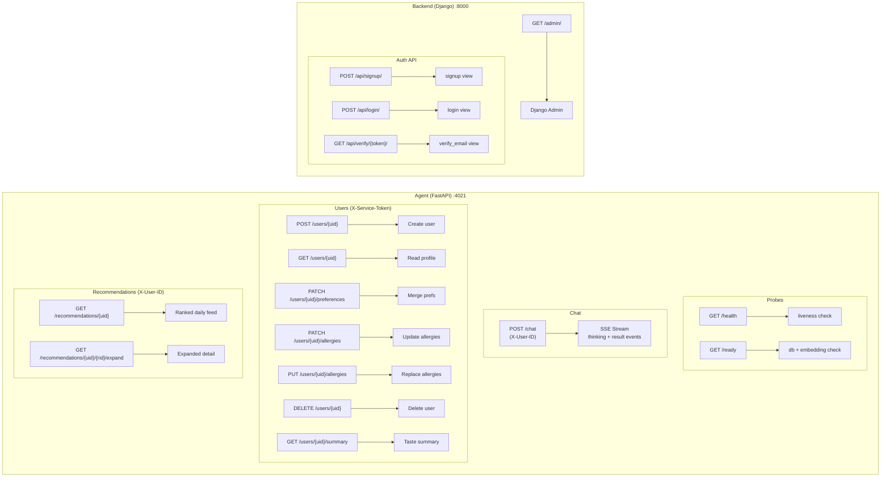

# API Reference — Kairos · Beyond Stars

This document provides the complete API reference for both the FastAPI Agent service and the Django Backend service. It documents every endpoint, its request and response contracts, authentication requirements, and error codes.

---

## 📋 Table of Contents

1. [Services Overview and Base URLs](#1-services-overview-and-base-urls)
2. [Authentication](#2-authentication)
3. [Agent API — All Endpoints](#3-agent-api--all-endpoints)
   - [Health & Readiness](#31-health--readiness)
   - [Chat — Streaming](#32-chat--streaming)
   - [Users Service API](#33-users-service-api)
   - [Recommendations](#34-recommendations)
4. [Backend API — All Endpoints](#4-backend-api--all-endpoints)
5. [API Route Map (Mermaid)](#5-api-route-map-mermaid)
6. [Rate Limiting and Pagination](#6-rate-limiting-and-pagination)
7. [Error Reference](#7-error-reference)
8. [Related Documents](#related-documents)

---

## 1. Services Overview and Base URLs

| Service | Local URL | Production URL | Purpose |
|---------|-----------|---------------|---------|
| Agent (FastAPI) | `http://localhost:4021` | `https://kairos-t1.gokulp.online` | AI chat, recommendations, user management |
| Backend (Django) | `http://localhost:8000` | — | User auth: signup, login, email verification |

All endpoints accept and return `application/json` unless otherwise noted. The chat endpoint returns `text/event-stream` (SSE).

---

## 2. Authentication

The platform uses two distinct authentication mechanisms.

### User Authentication (`X-User-ID`)

End-user requests to the Agent include the user's UUID — received from the Backend `POST /api/login/` response as `auth_id` — in the `X-User-ID` HTTP header. The Agent validates that the header is a valid UUID4 but does not cryptographically verify it. The Backend is responsible for issuing and validating user credentials.

```
X-User-ID: 550e8400-e29b-41d4-a716-446655440000
```

### Service Authentication (`X-Service-Token`)

Inter-service calls from the Backend to the Agent's `/users/*` endpoints use a shared secret token in the `X-Service-Token` header. The token must match the `SERVICE_TOKEN` environment variable in the Agent.

```
X-Service-Token: your-strong-random-service-token-here
```

> ⚠️ **Warning:** The `X-Service-Token` must never be sent from or exposed to the Frontend. It is only for Backend → Agent server-to-server communication.

---

## 3. Agent API — All Endpoints

### Summary Table

| Method | Route | Auth | Description |
|--------|-------|------|-------------|
| `GET` | `/health` | None | Liveness probe — always 200 |
| `GET` | `/ready` | None | Readiness probe — checks DB + embedding API |
| `POST` | `/chat` | `X-User-ID` | AI chat — SSE streaming response |
| `POST` | `/users/{uid}` | `X-Service-Token` | Create user record in Agent |
| `GET` | `/users/{uid}` | `X-Service-Token` | Retrieve user profile |
| `PATCH` | `/users/{uid}/preferences` | `X-Service-Token` | Merge user preferences |
| `PATCH` | `/users/{uid}/allergies` | `X-Service-Token` | Update confirmed allergies (safety-critical) |
| `PUT` | `/users/{uid}/allergies` | `X-Service-Token` | Replace confirmed allergies |
| `DELETE` | `/users/{uid}` | `X-Service-Token` | Delete user and all associated data |
| `GET` | `/users/{uid}/summary` | `X-Service-Token` | Retrieve user taste summary |
| `GET` | `/recommendations/{uid}` | `X-User-ID` | Personalised restaurant feed (cached 24h) |
| `GET` | `/recommendations/{uid}/{restaurant_id}/expand` | `X-User-ID` | Full detail for one recommendation |

---

### 3.1 Health & Readiness

#### `GET /health` — Liveness Probe

Returns immediately with a `healthy` status. Used by load balancers and container orchestrators to determine if the process is alive.

**Request:** No headers or body required.

**Response `200 OK`:**

```json
{
  "status": "healthy"
}
```

**curl example:**

```bash
curl http://localhost:4021/health
```

---

#### `GET /ready` — Readiness Probe

Performs two checks before returning: it verifies the PostgreSQL connection and makes a test call to the Google embedding API. Returns `503` if either check fails, indicating the service is not ready to receive traffic.

**Request:** No headers or body required.

**Response `200 OK`:**

```json
{
  "status": "ready",
  "database": "ok",
  "embedding_api": "ok"
}
```

**Response `503 Service Unavailable`:**

```json
{
  "status": "not_ready",
  "database": "error",
  "embedding_api": "ok",
  "detail": "Database connectivity check failed"
}
```

**curl example:**

```bash
curl http://localhost:4021/ready
```

---

### 3.2 Chat — Streaming

#### `POST /chat` — AI Chat with SSE Streaming

The core AI endpoint. Accepts a user message and conversation history, then streams the 5-step ReAct reasoning process as Server-Sent Events. The final `result` event carries a `GenerativeUIPayload` that the Frontend renders as a restaurant list, map, comparison chart, or text response.

**Request Headers:**

| Header | Required | Description |
|--------|----------|-------------|
| `Content-Type` | ✅ | `application/json` |
| `X-User-ID` | ✅ | User's UUID from Backend login response |
| `Cache-Control` | ❌ | Response sets `no-cache` automatically |

**Request Body:**

```json
{
  "message": "romantic dinner Koramangala under 1500 no peanuts",
  "conversation_history": [
    {
      "role": "user",
      "content": "I love Italian food"
    },
    {
      "role": "assistant",
      "content": "Great taste! I have a few suggestions..."
    }
  ]
}
```

| Field | Type | Required | Description |
|-------|------|----------|-------------|
| `message` | `string` | ✅ | Current user message (max 2000 chars) |
| `conversation_history` | `array[ChatMessage]` | ❌ | Prior turns. The orchestrator uses the last 6 entries (3 user + 3 assistant turns). |

**`ChatMessage` schema:**

| Field | Type | Values |
|-------|------|--------|
| `role` | `string` | `"user"` or `"assistant"` |
| `content` | `string` | Message text |

**Response: `text/event-stream` (SSE)**

The response streams multiple events. Events are newline-delimited JSON objects in the format `data: <json>\n\n`.

**Thinking events (multiple, one per step):**

```
data: {"event": "thinking", "data": {"step": "context_loaded", "message": "Loaded user profile"}}

data: {"event": "thinking", "data": {"step": "decomposed", "message": "Query decomposed into search parameters"}}

data: {"event": "thinking", "data": {"step": "search_complete", "message": "Found 12 restaurants"}}

data: {"event": "thinking", "data": {"step": "evaluated", "message": "Ranked and annotated results"}}

data: {"event": "thinking", "data": {"step": "guard_complete", "message": "AllergyGuard: 2 warnings flagged"}}
```

**Result event (final, one per request):**

```
data: {"event": "result", "data": {
  "ui_type": "restaurant_list",
  "text_response": "Here are 5 romantic restaurants in Koramangala under ₹1500...",
  "restaurants": [
    {
      "id": "abc123",
      "name": "Toscano",
      "cuisine_types": ["Italian"],
      "price_tier": "$$",
      "rating": 4.6,
      "fit_score": 93,
      "fit_tags": ["Great for couples", "Matches cuisine preference", "Within budget"],
      "allergy_warning": null,
      "allergen_confidence": "low",
      "radar_scores": {
        "ambiance": 90,
        "service": 85,
        "food": 92,
        "value": 78,
        "location": 88
      },
      "ai_summary": "A warm, candlelit Italian bistro with excellent pasta and a curated wine list."
    }
  ],
  "allergy_warnings": [],
  "has_allergy_warnings": false,
  "clarification_needed": false
}}
```

**`GenerativeUIPayload` field reference:**

| Field | Type | Description |
|-------|------|-------------|
| `ui_type` | `string` | One of `restaurant_list`, `map_view`, `comparison_chart`, `text` |
| `text_response` | `string` | Human-readable introduction to the results |
| `restaurants` | `array[RestaurantResult]` | Annotated restaurant objects |
| `allergy_warnings` | `array[AllergyWarning]` | Warnings for flagged restaurants |
| `has_allergy_warnings` | `bool` | `true` if any restaurant has safety warnings |
| `clarification_needed` | `bool` | `true` if Gemma determined more info is needed |

**Error responses:**

| Code | Body | Cause |
|------|------|-------|
| `400 Bad Request` | `{"detail": "Invalid X-User-ID format"}` | `X-User-ID` is not a valid UUID |
| `422 Unprocessable Entity` | Pydantic validation errors | Malformed request body |
| `503 Service Unavailable` | `{"detail": "...", "code": "AGENT_UNAVAILABLE"}` | Gemma or database unavailable |

**curl example:**

```bash
curl -X POST http://localhost:4021/chat \
  -H "Content-Type: application/json" \
  -H "X-User-ID: 550e8400-e29b-41d4-a716-446655440000" \
  -d '{"message": "good biryani near MG Road", "conversation_history": []}' \
  --no-buffer
```

---

### 3.3 Users Service API

All `/users/*` endpoints require the `X-Service-Token` header and are intended for Backend → Agent communication only.

#### `POST /users/{uid}` — Create User

Creates a new user record in the Agent database when a user registers via the Backend.

**Request:**

```json
{
  "email": "user@example.com"
}
```

**Response `201 Created`:**

```json
{
  "uid": "550e8400-e29b-41d4-a716-446655440000",
  "created": true
}
```

**Response `200 OK`** (user already exists — idempotent):

```json
{
  "uid": "550e8400-e29b-41d4-a716-446655440000",
  "created": false
}
```

---

#### `GET /users/{uid}` — Get User Profile

Returns the complete user profile including preferences and allergy flags.

**Response `200 OK`:**

```json
{
  "uid": "550e8400-e29b-41d4-a716-446655440000",
  "preferences": {
    "dietary": ["vegetarian"],
    "vibes": ["romantic", "quiet"],
    "cuisine_affinity": ["Italian", "Japanese"],
    "cuisine_aversion": [],
    "price_comfort": ["$$", "$$$"]
  },
  "allergies": {
    "confirmed": ["peanuts", "shellfish"],
    "severity": {
      "peanuts": "anaphylactic",
      "shellfish": "severe"
    }
  },
  "allergy_flags": ["peanuts", "shellfish"],
  "dietary_flags": ["vegetarian"],
  "interaction_count": 14,
  "last_active_at": "2026-02-28T10:30:00Z"
}
```

---

#### `PATCH /users/{uid}/preferences` — Merge Preferences

Deep-merges the provided preference object with the existing preferences. Arrays are unioned, not replaced.

**Request:**

```json
{
  "dietary": ["vegan"],
  "vibes": ["lively"],
  "cuisine_affinity": ["Thai"]
}
```

**Response `200 OK`:**

```json
{
  "uid": "550e8400-e29b-41d4-a716-446655440000",
  "preferences": { "...merged result..." }
}
```

---

#### `PATCH /users/{uid}/allergies` — Update Allergies

Adds new allergens to the user's confirmed allergy list. Input allergen names are normalised using `ALLERGEN_SYNONYMS` before storage.

> ⚠️ **Warning:** This is a safety-critical endpoint. Incorrect data here directly affects which restaurants are shown to the user. Always validate the input against `CANONICAL_ALLERGENS` before calling.

**Request:**

```json
{
  "confirmed": ["peanuts", "tree nuts"],
  "severity": {
    "peanuts": "anaphylactic",
    "tree nuts": "severe"
  }
}
```

**Response `200 OK`:**

```json
{
  "uid": "550e8400-e29b-41d4-a716-446655440000",
  "allergy_flags": ["peanuts", "tree nuts"],
  "updated": true
}
```

---

#### `DELETE /users/{uid}` — Delete User

Cascades to delete all interactions associated with the user.

**Response `204 No Content`** (no body).

**Response `404 Not Found`:**

```json
{
  "detail": "User not found"
}
```

---

#### `GET /users/{uid}/summary` — User Taste Summary

Returns a Gemma-generated natural language summary of the user's taste profile.

**Response `200 OK`:**

```json
{
  "uid": "550e8400-e29b-41d4-a716-446655440000",
  "summary": "You enjoy romantic Italian and Japanese restaurants in the $$-$$$ range. You prefer a quiet, intimate vibe and avoid spicy food. You have a peanut allergy (anaphylactic) — I always ensure your recommendations are peanut-free."
}
```

---

### 3.4 Recommendations

#### `GET /recommendations/{uid}` — Personalised Feed

Returns a ranked list of recommended restaurants tailored to the user's taste profile. Results are cached for 24 hours per user (keyed by `sha256(uid + date.today())`).

**Request Headers:**

| Header | Required | Description |
|--------|----------|-------------|
| `X-User-ID` | ✅ | Must match the `{uid}` path parameter |

**Query Parameters:**

| Parameter | Type | Default | Description |
|-----------|------|---------|-------------|
| `limit` | `integer` | `10` | Number of recommendations to return (max 50) |
| `refresh` | `boolean` | `false` | If `true`, bypasses the TTL cache and rebuilds the feed |

**Response `200 OK`:**

```json
{
  "uid": "550e8400-e29b-41d4-a716-446655440000",
  "restaurants": [
    {
      "id": "abc123",
      "name": "Toscano",
      "fit_score": 93,
      "fit_tags": ["Matches cuisine preference", "Great for couples", "Within budget"],
      "allergy_safe": true,
      "allergy_warnings": []
    }
  ],
  "generated_at": "2026-02-28T00:00:00Z",
  "from_cache": true
}
```

---

#### `GET /recommendations/{uid}/{restaurant_id}/expand` — Expand Detail

Returns extended information for a single recommendation including an AI-generated summary, highlight points, radar scores, and complete allergen analysis.

**Response `200 OK`:**

```json
{
  "restaurant": {
    "id": "abc123",
    "name": "Toscano",
    "cuisine_types": ["Italian"],
    "price_tier": "$$$",
    "rating": 4.7,
    "fit_score": 93
  },
  "ai_summary": "Toscano offers an exceptional romantic dining experience...",
  "highlights": ["Award-winning pasta", "Extensive wine list", "Candlelit ambiance"],
  "radar_scores": {
    "ambiance": 95,
    "service": 88,
    "food": 94,
    "value": 80,
    "location": 90
  },
  "allergen_analysis": {
    "safe_for_user": true,
    "allergens_present": [],
    "confidence": "high"
  }
}
```

---

## 4. Backend API — All Endpoints

### Summary Table

| Method | Route | Auth | Description |
|--------|-------|------|-------------|
| `POST` | `/api/signup/` | None | Register a new user, send verification email |
| `POST` | `/api/login/` | None | Authenticate, return `auth_id` UUID |
| `GET` | `/api/verify/{token}/` | None (link in email) | Verify email address, activate account |
| `GET` | `/admin/` | Django admin session | Django admin panel |

---

#### `POST /api/signup/` — User Registration

Creates a new `User` record, generates a `auth_token` UUID, and sends a verification email. Does **not** yet call the Agent to provision the corresponding user record (known gap — see [docs/SUMMARY.md](SUMMARY.md#6-current-status-and-known-limitations)).

**Request Body:**

```json
{
  "username": "gokul",
  "email": "me@gokulp.in",
  "password": "supersecret"
}
```

| Field | Type | Required | Constraints |
|-------|------|----------|-------------|
| `username` | `string` | ✅ | Unique, max 150 chars |
| `email` | `string` | ✅ | Valid email format, unique |
| `password` | `string` | ✅ | Currently stored in plaintext (known critical issue) |

**Response `200 OK`:**

```json
{
  "message": "Signup successful. Please verify your email."
}
```

**Response `400 Bad Request`** (duplicate email):

```json
{
  "error": "Email already registered"
}
```

**curl example:**

```bash
curl -X POST http://localhost:8000/api/signup/ \
  -H "Content-Type: application/json" \
  -d '{"username":"gokul","email":"me@gokulp.in","password":"supersecret"}'
```

---

#### `POST /api/login/` — User Login

Authenticates a user and returns their `auth_token` UUID. The verification check (`is_verified = True`) is enforced — unverified users cannot log in.

**Request Body:**

```json
{
  "email": "me@gokulp.in",
  "password": "supersecret"
}
```

**Response `200 OK`:**

```json
{
  "message": "Login successful",
  "auth_id": "550e8400-e29b-41d4-a716-446655440000"
}
```

**Response `400 Bad Request`** (invalid credentials):

```json
{
  "error": "Invalid credentials"
}
```

**Response `403 Forbidden`** (unverified account):

```json
{
  "error": "Email not verified. Please check your inbox."
}
```

**curl example:**

```bash
curl -X POST http://localhost:8000/api/login/ \
  -H "Content-Type: application/json" \
  -d '{"email":"me@gokulp.in","password":"supersecret"}'
```

---

#### `GET /api/verify/{token}/` — Email Verification

Called from the URL in the verification email. Sets `is_verified = True` on the corresponding `User` record. The `{token}` is the user's `auth_token` UUID.

**Response `200 OK`:**

```json
{
  "message": "Email verified successfully. You can now log in."
}
```

**Response `404 Not Found`:**

```json
{
  "error": "Invalid or expired verification token"
}
```

**curl example:**

```bash
curl http://localhost:8000/api/verify/550e8400-e29b-41d4-a716-446655440000/
```

---

## 5. API Route Map (Mermaid)



---

## 6. Rate Limiting and Pagination

**Chat endpoint (`POST /chat`):** No explicit rate limiting is configured in the current codebase. The Gemma API has its own quota limits (requests-per-minute) that will return a `429` from the Google API layer, which the Agent propagates as a `503`. For production, add a rate limiter middleware (e.g., `slowapi`) to limit to 10–20 requests per user per minute.

**Recommendations endpoint:** Returns a maximum of 50 restaurants (enforced by the `limit` query parameter max). No cursor-based pagination is implemented — the full result set is returned in a single response.

**Users endpoints:** No pagination — user records are singular by UID.

**Embedding API:** The `embed_texts()` function in `services/embedding.py` automatically batches embeddings in groups of 100 with a 0.5-second sleep between batches. This is not a limit on the API endpoint itself but a client-side rate throttle for the ingestion pipeline.

---

## 7. Error Reference

### Agent Error Codes

| HTTP Code | `code` field | Cause |
|-----------|-------------|-------|
| `400` | — | Invalid UUID in `X-User-ID` |
| `401` | `UNAUTHORIZED` | Missing or invalid `X-Service-Token` |
| `403` | `FORBIDDEN` | UID in path does not match UID in `X-User-ID` header |
| `404` | `NOT_FOUND` | User or restaurant not found |
| `422` | — | Pydantic validation error on request body |
| `503` | `AGENT_UNAVAILABLE` | Gemma API, embedding API, or database unreachable |

### Backend Error Codes

| HTTP Code | `error` field | Cause |
|-----------|--------------|-------|
| `400` | `Email already registered` | Duplicate email on signup |
| `400` | `Invalid credentials` | Wrong email or password on login |
| `403` | `Email not verified` | Login attempt before verification |
| `404` | `Invalid or expired verification token` | Verification URL with unknown token |

---

## Related Documents

- [docs/ARCHITECTURE.md](ARCHITECTURE.md) — System architecture and data flow
- [Agent/docs/API.md](../Agent/docs/API.md) — Agent-specific API internals and integration specs
- [Backend/docs/API.md](../Backend/docs/API.md) — Backend API with integration architecture
- [Frontend/docs/API.md](../Frontend/docs/API.md) — Frontend API integration reference
