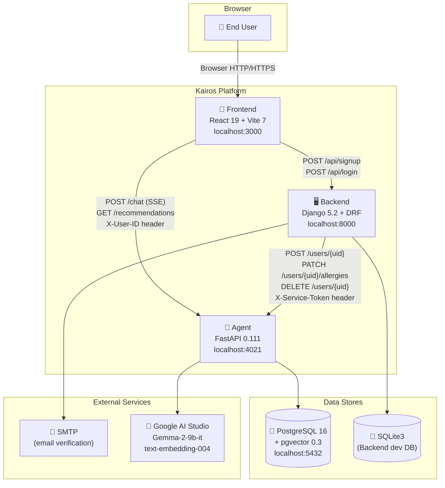
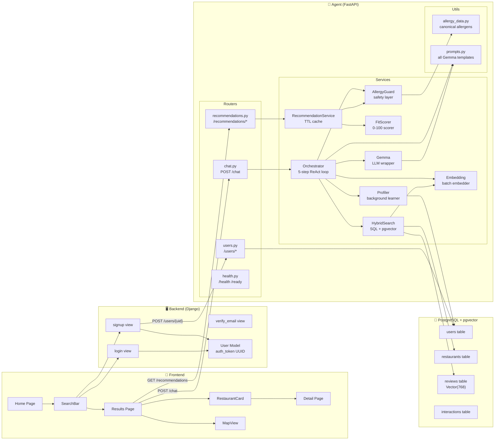
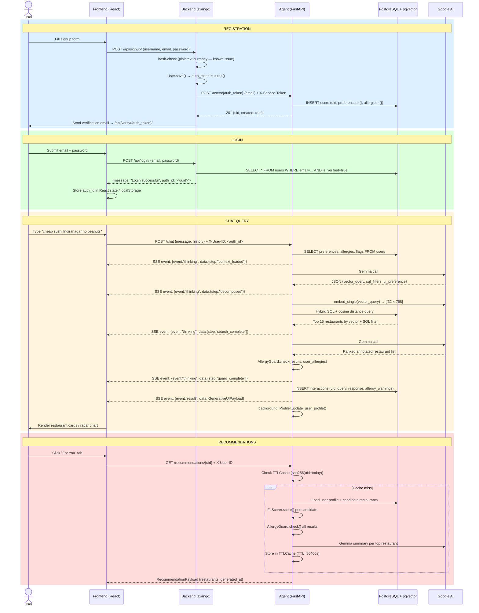

# System Architecture — Kairos · Beyond Stars

This document describes the complete system architecture of the Kairos Beyond Stars platform: how the three modules (Agent, Backend, and Frontend) relate to one another, what technology choices were made and why, and how the platform can be extended as it grows.

---

## 📋 Table of Contents

1. [High-Level Overview](#1-high-level-overview)
2. [System Context Diagram](#2-system-context-diagram)
3. [Component Interaction Diagram](#3-component-interaction-diagram)
4. [Full Data Flow Sequence](#4-full-data-flow-sequence)
5. [Technology Decision Rationale](#5-technology-decision-rationale)
6. [Scalability and Extension Notes](#6-scalability-and-extension-notes)
7. [Known Architectural Constraints](#7-known-architectural-constraints)
8. [Related Documents](#related-documents)

---

## 1. High-Level Overview

Kairos Beyond Stars is composed of three independently deployable services that communicate over HTTP. Each service owns a specific slice of the platform's responsibilities: the **Backend (Django)** owns user identity and authentication, the **Agent (FastAPI)** owns AI reasoning and personalisation, and the **Frontend (React)** owns the user interface and experience.

The most important architectural property is the **identity bridge**: Django's `auth_token` UUID field, generated at signup, is the single universal identifier used by all three modules. The Frontend stores this value (returned from the `POST /api/login/` endpoint) and forwards it as the `X-User-ID` HTTP header on every Agent call. The Agent stores the same value as its `uid` primary key. This means the Backend, Agent, and Frontend can each operate independently as long as they share this UUID.

The second key architectural decision is that **all AI traffic bypasses the Backend**. The Frontend talks to the Agent directly for chat and recommendations. The Backend only interferes at user lifecycle events — signup, allergy change, and deletion — where it fires synchronous calls to the Agent's service API (protected by `X-Service-Token`). This keeps the Backend thin and the AI path low-latency: a chat response is never delayed by a Django middleware chain.

The third pillar is **safety isolation**: allergy data is physically separated from preference data in two distinct JSONB columns and can only be written through the Backend service API. The agent's background profiler, which learns user preferences from conversation, has an explicit allowlist that excludes allergy keys. This means allergy data cannot be inferred, overwritten, or contaminated by chat activity under any circumstances.

---

## 2. System Context Diagram

> 💡 **Tip:** In production, replace `localhost` references with your actual domain names. The Agent is accessible at `https://kairos-t1.gokulp.online` and should be behind an Nginx reverse proxy.

---

## 3. Component Interaction Diagram

This diagram shows the internal components of each module and the interfaces through which they communicate.

---

## 4. Full Data Flow Sequence

This sequence diagram captures the complete lifecycle of a user interaction from first visit through registration, login, and a live chat query.

---

## 5. Technology Decision Rationale

This section explains the reasoning behind the major technology choices. All decisions are grounded in the actual code and configuration of the system.

### FastAPI + Uvicorn for the Agent

FastAPI is selected for the Agent because the core delivery mechanism is Server-Sent Events (SSE) streaming. The chat endpoint must yield partial results as the orchestrator processes each step of its ReAct loop. FastAPI's `StreamingResponse` with an `AsyncGenerator` makes this trivial and efficient. Uvicorn's async event loop handles thousands of concurrent SSE connections without blocking, which is critical for a chat-heavy application.

### PostgreSQL + pgvector for vector storage

The restaurant discovery feature requires combining traditional SQL filters (cuisine type, price tier, allergen exclusions) with semantic vector similarity search (to find "romantic date restaurants" even without those exact words in the data). PostgreSQL with the pgvector extension handles both in a single query using `WHERE` clauses combined with `<=> cosine_distance` ordering. Using a separate vector database (like Chroma or Pinecone) would require a two-step fetch that is harder to keep consistent. PostgreSQL + pgvector keeps the data layer simple and transactionally consistent.

### Google Gemma-2-9b-it + text-embedding-004

Gemma-2-9b-it is used for the two LLM reasoning steps in the orchestrator (query decomposition and result evaluation). The 9B parameter instruction-tuned model provides strong JSON-adhering output at a reasonable cost. The `call_gemma_json()` wrapper in `gemma.py` applies defensive markdown-fence stripping to handle models that sometimes wrap JSON in code blocks. `text-embedding-004` produces 768-dimensional embeddings which are stored directly in the PostgreSQL `Vector(768)` column — no dimension mismatch, no projection layer needed.

### Pydantic v2 + pydantic-settings for configuration

All environment variables are bound through a single `Settings(BaseSettings)` class in `config.py`. The `@lru_cache(maxsize=1)` decorator on `get_settings()` means the settings object is only instantiated once per process, eliminating repeated disk I/O. Pydantic v2's type coercions handle integer ports, comma-split lists, and boolean flags without custom parsing code.

### Async SQLAlchemy 2.0

The Agent uses async SQLAlchemy with `create_async_engine` (pool_size=10, max_overflow=20, pool_pre_ping=True). Every database operation is non-blocking, allowing Uvicorn to serve other requests while a query is in flight. The `get_db()` dependency provides per-request sessions with automatic rollback on exception, preventing connection leaks.

### Django 5.2 for the Backend

Django is used for the Backend because its built-in ORM, admin panel, and management commands provide a rapid path to a working auth system. The `auth_token = UUIDField(default=uuid.uuid4, editable=False)` pattern is idiomatic Django and produces the UUID that bridges all three modules. The trade-off is that Django's sync ORM is not directly compatible with async frameworks — for the thin auth service this project requires, this trade-off is acceptable.

### React 19 + Vite 7 for the Frontend

Vite provides sub-second HMR (Hot Module Replacement) during development and a highly optimised esbuild-based production bundle. React 19 introduces concurrent features that will be valuable when the SSE streaming responses are wired to the UI, as they allow rendering partial results without blocking the main thread. Tailwind CSS v4 eliminates the need for a component library — all UI is composed from utility classes, keeping the bundle lean.

---

## 6. Scalability and Extension Notes

The platform is designed for horizontal scaling of the Agent service. Because SQLAlchemy uses a connection pool and the session is dependency-injected per request (not a global singleton), multiple Agent replicas can share the same PostgreSQL instance behind a load balancer. The TTLCache for recommendations is an in-process cache, so each replica maintains its own cache — this is acceptable for the current scale; a Redis shared cache can be added without changing the public API interface.

The AllergyGuard is stateless and pure-Python, making it trivially parallelisable. The FitScorer is also stateless. The most expensive operation is the two Gemma API calls per chat turn — these can be replaced with a self-hosted Gemma model if the Google AI API latency becomes a bottleneck.

The recommendation system supports a `?refresh=true` query parameter to bypass the TTL cache, which allows forced refresh after major preference changes (e.g., new dietary restriction added). The cache key includes `date.today()` as a salt, so the cache automatically invalidates at midnight.

For the Frontend, the Generative UI pattern means the Backend returns a `ui_type` field in every response that determines which component the Frontend renders. This pattern supports adding new UI types (e.g., a calendar booking widget, a delivery time estimator) without changing the chat API contract. The Frontend just needs to handle the new `ui_type` value.

---

## 7. Known Architectural Constraints

| Constraint | Severity | Location | Recommended Fix |
|-----------|----------|----------|-----------------|
| Passwords stored in plaintext | Critical | `Backend/core/views.py` | Use `django.contrib.auth.hashers.make_password` |
| Django `SECRET_KEY` hardcoded | Critical | `beyondstars_backend/settings.py` | Read from `os.environ` |
| `recommendations.py` router not registered in `main.py` | High | `Agent/app/main.py` | Add `app.include_router(recommendations.router)` |
| `chroma_client.py` references `settings.chroma_path` not in Settings | Medium | `Agent/app/services/chroma_client.py` | Add `chroma_path: str = "chroma_store"` to Settings |
| `local_ml.py` 384-dim embeddings incompatible with `Vector(768)` column | Medium | `Agent/app/services/local_ml.py` | Add separate `Vector(384)` column or normalise to 768 |
| Frontend uses static `dummyData.js` — no live API integration | High | `Frontend/beyond-stars/src/data/dummyData.js` | Wire `SearchBar` to POST /chat SSE stream |
| No auth flow in Frontend | High | `Frontend/beyond-stars/src/` | Add Login/Signup pages, store `auth_id` |
| No test suite in `requirements.txt` | Medium | `Agent/requirements.txt` | Add `pytest`, `pytest-asyncio`, `httpx` |

---

## Related Documents

- [docs/SETUP.md](SETUP.md) — Step-by-step local environment setup guide
- [docs/API.md](API.md) — Full API reference for all endpoints
- [docs/DEPLOYMENT.md](DEPLOYMENT.md) — Production deployment walkthrough
- [Agent/docs/ARCHITECTURE.md](../Agent/docs/ARCHITECTURE.md) — Agent-specific architecture
- [Backend/docs/ARCHITECTURE.md](../Backend/docs/ARCHITECTURE.md) — Backend-specific architecture
- [Frontend/docs/ARCHITECTURE.md](../Frontend/docs/ARCHITECTURE.md) — Frontend-specific architecture
- [Backend/AGENT_INTEGRATION_REPORT.md](../Backend/AGENT_INTEGRATION_REPORT.md) — Integration report
