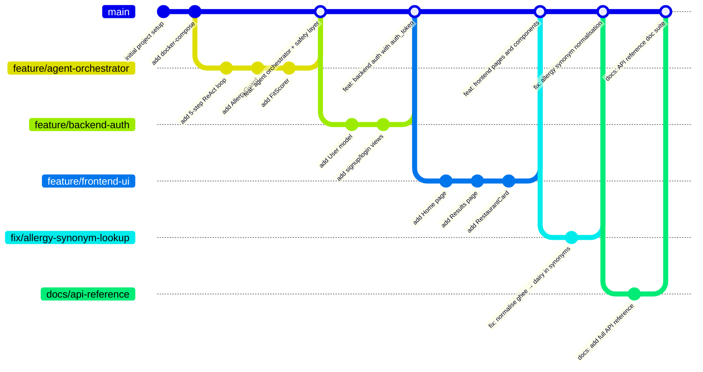

# Contributing Guide — Kairos · Beyond Stars

This guide describes the process for contributing to the Kairos Beyond Stars platform, including the Git branching strategy, commit conventions, pull request workflow, and per-module coding standards.

---

## 📋 Table of Contents

1. [Git Branching Strategy](#1-git-branching-strategy)
2. [Commit Message Convention](#2-commit-message-convention)
3. [Pull Request Checklist](#3-pull-request-checklist)
4. [Code Style Rules](#4-code-style-rules)
5. [Adding Features to Each Submodule](#5-adding-features-to-each-submodule)
6. [Related Documents](#related-documents)

---

## 1. Git Branching Strategy

The repository uses a simplified trunk-based development model with short-lived feature branches. `main` is always deployable. All work is done in branches and merged via pull requests — no direct commits to `main`.



### Branch Naming

| Type | Pattern | Example |
|------|---------|---------|
| New feature | `feature/<short-description>` | `feature/recommendation-cache` |
| Bug fix | `fix/<short-description>` | `fix/allergen-synonym-lookup` |
| Documentation | `docs/<short-description>` | `docs/api-reference` |
| Chore / dependency | `chore/<short-description>` | `chore/upgrade-fastapi-0-112` |
| Hotfix (prod issue) | `hotfix/<short-description>` | `hotfix/alergy-guard-bypass` |
| QA / testing | `test/<short-description>` | `test/allergy-guard-matrix` |

Keep branch names lowercase, hyphen-separated, and under 40 characters. Delete branches after merging.

---

## 2. Commit Message Convention

All commit messages follow the **Conventional Commits** specification. This enables automated changelog generation and makes it easy to understand a branch's purpose from `git log`.

```
<type>(<scope>): <short summary>

[optional body: 1-3 sentences explaining what and why]

[optional footer: BREAKING CHANGE: ..., Closes #123]
```

| Type | When to Use | Affects Changelog |
|------|------------|------------------|
| `feat` | New user-facing feature | ✅ Yes |
| `fix` | Bug fix | ✅ Yes |
| `docs` | Documentation only | ✅ Yes |
| `test` | Adding or updating tests | ❌ No |
| `chore` | Build process, dependency updates | ❌ No |
| `refactor` | Code restructuring (no new feature, no bug fix) | ❌ No |
| `perf` | Performance improvement | ✅ Yes |
| `style` | Formatting, whitespace, linting | ❌ No |
| `ci` | CI/CD configuration changes | ❌ No |

**Scope** is the module or component affected:

| Scope | Examples |
|-------|---------|
| `agent` | Changes to `Agent/app/` |
| `backend` | Changes to `Backend/` |
| `frontend` | Changes to `Frontend/` |
| `db` | Schema or migration changes |
| `ingest` | Ingestion script changes |
| `docs` | Documentation files |
| `ci` | CI/CD workflows |

**Examples:**

```
feat(agent): add TTL cache for recommendation feed

Implements a 24-hour in-process TTLCache keyed by sha256(uid+date).
Reduces Google API calls by ~95% for returning users.

Closes #42
```

```
fix(agent): normalise "ghee" to "dairy" in allergen synonyms

ALLERGEN_SYNONYMS was missing several common Indian dairy synonyms.
Fixes incorrect allergen-free results for lactose-intolerant users.

BREAKING CHANGE: Users with existing "ghee" allergy entries will now
have their flag canonicalised to "dairy" on next profile load.
```

```
feat(frontend): add CircularProgress SVG score indicator

Animates from 0 to the match score value using strokeDashoffset
transition. Color thresholds: green ≥95, blue ≥90, amber ≥85, red <85.
```

---

## 3. Pull Request Checklist

Every PR must pass this checklist before merge. The author self-reviews against this list before requesting a review.

### Code Quality

- [ ] The PR is focused on a single feature or fix (one concern per PR)
- [ ] No commented-out code is left in the diff
- [ ] No debug `print()` statements in Agent or Backend, no `console.log()` in Frontend
- [ ] No hardcoded secrets, credentials, or API keys in any file
- [ ] No `.env` file committed (verify with `git status --short`)

### Tests

- [ ] New features include at least one test (unit or integration)
- [ ] Existing tests still pass (`pytest` / `manage.py test` / `npm run lint`)
- [ ] Allergy-related changes include a test case for the safety path (mandatory)

### Documentation

- [ ] New Agent endpoints are documented in [Agent/docs/API.md](../Agent/docs/API.md)
- [ ] New Backend endpoints are documented in [Backend/docs/API.md](../Backend/docs/API.md)
- [ ] New Frontend components are documented in [Frontend/docs/COMPONENTS.md](../Frontend/docs/COMPONENTS.md)
- [ ] New environment variables are added to `.env.example` with descriptions

### Safety

- [ ] Any change to `AllergyGuard`, `allergy_data.py`, or `sql_filters.exclude_allergens` has been reviewed by the Team Lead
- [ ] The `_ALLOWED_PREFERENCE_KEYS` allowlist in `profiler.py` has not been extended to include any allergy-related key
- [ ] Database schema changes come with an up-migration generated by `alembic` or SQLAlchemy

### PR Description Template

```markdown
## What this PR does
<!-- 1-3 sentences describing the change -->

## Why
<!-- Context and motivation -->

## How to test
<!-- Steps a reviewer can follow to verify the change -->

## Checklist
- [ ] Self-reviewed against the PR checklist in CONTRIBUTING.md
- [ ] Tests pass
- [ ] No secrets committed
```

---

## 4. Code Style Rules

### Python (Agent + Backend)

The Agent and Backend follow PEP 8 with the following project-specific conventions:

| Rule | Detail |
|------|--------|
| Formatter | `black` with 88-character line length |
| Import sorter | `isort` with `profile=black` |
| Type hints | Required on all public functions and methods |
| Docstrings | Google-style docstrings on all classes and public functions |
| Async | All database I/O and external API calls must use `async`/`await` |
| Exception handling | Never use bare `except:` — always catch specific exception types |
| Logging | Use `logging.getLogger(__name__)` — no `print()` in production code |
| Constants | UPPER_SNAKE_CASE at module level |

**Agent-specific rules:**

- All Gemma prompts live in `utils/prompts.py`. Never hardcode prompt strings inside service functions.
- All allergen data lives in `utils/allergy_data.py`. Never hardcode allergen strings in services.
- Services must be stateless and injectable. No module-level state that changes after startup.
- The `AllergyGuard.check()` call is mandatory on all code paths that return restaurant results. This is enforced in code review.

**Backend-specific rules:**

- API views use DRF's `@api_view` decorator and return `Response` objects with explicit status codes.
- Serializers use `ModelSerializer` with explicit `fields` list — avoid `fields = '__all__'` in production.
- All model changes require a corresponding migration: `python manage.py makemigrations`.

### JavaScript / React (Frontend)

| Rule | Detail |
|------|--------|
| Linter | ESLint with `eslint-plugin-react-hooks` and `eslint-plugin-react-refresh` |
| Formatter | Prettier (default config) |
| Components | Functional components with hooks — no class components |
| Prop types | Use JSDoc `@param` blocks or migrate to TypeScript |
| State | `useState` for local state; `useContext` for cross-component state (no Redux for this scale) |
| Side effects | All data fetching in `useEffect` or custom hooks |
| File naming | PascalCase for component files (`RestaurantCard.jsx`), camelCase for utilities |
| Tailwind | Utility classes directly in JSX — no `@apply` except for highly repeated patterns in `index.css` |

**Frontend-specific rules:**

- Never hardcode the Agent or Backend URL directly in component files. Use environment variables (`import.meta.env.VITE_AGENT_URL`).
- SSE connections must be cleaned up in the `useEffect` return function to prevent memory leaks.
- All components that make API calls must handle loading, error, and empty states.

---

## 5. Adding Features to Each Submodule

### Adding a Feature to the Agent

1. **Create a service** in `Agent/app/services/<feature>.py`. Keep it stateless and async.
2. **Add Pydantic schemas** in `Agent/app/schemas/<domain>.py` for all input/output types.
3. **Create or update a router** in `Agent/app/routers/<router>.py`. Register it in `main.py`.
4. **Add prompts** (if Gemma is involved) to `Agent/app/utils/prompts.py`.
5. **Update allergy data** (if allergen-related) in `Agent/app/utils/allergy_data.py`.
6. **Write a test** in `Agent/tests/`.
7. **Document the endpoint** in [Agent/docs/API.md](../Agent/docs/API.md).

```python
# Example: adding a new service
# Agent/app/services/my_feature.py

import logging
from sqlalchemy.ext.asyncio import AsyncSession

logger = logging.getLogger(__name__)

async def my_feature(uid: str, db: AsyncSession) -> dict:
    """One-line summary.

    Args:
        uid: User UUID string.
        db: Async SQLAlchemy session.

    Returns:
        Dict with result data.
    """
    try:
        # implementation
        return {"result": "..."}
    except Exception:
        logger.exception("my_feature failed for uid=%s", uid)
        raise
```

### Adding a Feature to the Backend

1. **Add a model field** in `Backend/core/models.py` and run `python manage.py makemigrations`.
2. **Update the serializer** in `Backend/core/serializers.py`.
3. **Add a view function** in `Backend/core/views.py` using `@api_view`.
4. **Register the URL** in `Backend/core/urls.py`.
5. **Write a test** in `Backend/core/tests.py`.
6. **Document the endpoint** in [Backend/docs/API.md](../Backend/docs/API.md).

### Adding a Feature to the Frontend

1. **Create the component** in `Frontend/beyond-stars/src/components/<ComponentName>.jsx`.
2. **Add props table** and usage example to [Frontend/docs/COMPONENTS.md](../Frontend/docs/COMPONENTS.md).
3. **Update the page** that uses the component (e.g., add it to `Results.jsx`).
4. **Add to the component tree diagram** in [Frontend/docs/ARCHITECTURE.md](../Frontend/docs/ARCHITECTURE.md).
5. **Run** `npm run lint` and `npm run build` to verify no regressions.

---

## Related Documents

- [docs/TESTING.md](TESTING.md) — Testing strategy and QA process
- [docs/ARCHITECTURE.md](ARCHITECTURE.md) — System architecture
- [Agent/docs/API.md](../Agent/docs/API.md) — Agent API reference
- [Backend/docs/API.md](../Backend/docs/API.md) — Backend API reference
- [Frontend/docs/COMPONENTS.md](../Frontend/docs/COMPONENTS.md) — Component reference
