# Deployment Guide — Kairos · Beyond Stars

This guide covers deploying the Kairos Beyond Stars platform to a production environment, including Docker Compose orchestration, environment configuration, health monitoring, and rollback procedures.

---

## 📋 Table of Contents

1. [Deployment Architecture Overview](#1-deployment-architecture-overview)
2. [Deployment Pipeline](#2-deployment-pipeline)
3. [Production Environment Configuration](#3-production-environment-configuration)
4. [Docker Compose Production Deployment](#4-docker-compose-production-deployment)
5. [Health Check and Monitoring](#5-health-check-and-monitoring)
6. [Rollback Procedure](#6-rollback-procedure)
7. [Related Documents](#related-documents)

---

## 1. Deployment Architecture Overview

The target production topology runs all three services as independent processes behind an Nginx reverse proxy. The PostgreSQL + pgvector container is the only stateful component and must be provisioned before the Agent starts. The Backend (Django) and Frontend (static files served by Nginx) are stateless.

The production Agent is reachable at `https://kairos-t1.gokulp.online`. The domain resolves to the host running Docker Compose. Nginx handles TLS termination, CORS pre-flight forwarding, and SSE response buffering (disabled via `X-Accel-Buffering: no`).

---

## 2. Deployment Pipeline

```mermaid
flowchart TD
    A["Developer pushes to main branch"] --> B["Pull latest code on server\ngit pull origin main"]
    B --> C["Copy production .env\ncp .env.prod Agent/.env"]
    C --> D["Start / restart database container\ndocker compose up -d db"]
    D --> E{"Database healthcheck passes?"}
    E -- No --> F["Check logs:\ndocker compose logs db"]
    F --> E
    E -- Yes --> G["Run ingest if new data\n./run_ingest.sh --csv data/zomato.csv"]
    G --> H["Start Agent server\nAPP_ENV=production WORKERS=4 ./run.sh"]
    H --> I["Apply Django migrations\npython manage.py migrate"]
    I --> J["Start Django Backend\ngunicorn beyondstars_backend.wsgi:application"]
    J --> K["Build and serve Frontend\nnpm run build\nnginx serve dist/"]
    K --> L["Verify liveness probe\ncurl https://kairos-t1.gokulp.online/health"]
    L --> M{"Probe returns 'healthy'?"}
    M -- No --> N["Check Agent logs\njournalctl -u kairos-agent"]
    N --> L
    M -- Yes --> O["Verify readiness probe\ncurl .../ready"]
    O --> P{"DB + Embedding API ready?"}
    P -- No --> Q["Check DATABASE_URL and GOOGLE_API_KEY"]
    Q --> O
    P -- Yes --> R["Deployment complete ✅"]
```



---

## 3. Production Environment Configuration

The following changes are **mandatory** before any production deployment. Failure to apply these will result in security vulnerabilities and/or data exposure.

| Variable | Development Value | Production Value | Why |
|----------|------------------|-----------------|-----|
| `APP_ENV` | `development` | `production` | Disables SQL echo, hot-reload; enables Gunicorn multi-worker |
| `DJANGO_DEBUG` | `True` | `False` | Prevents traceback exposure in HTTP responses |
| `DJANGO_SECRET_KEY` | hardcoded in settings.py | Strong random key from env var | Hardcoded key is public knowledge |
| `SERVICE_TOKEN` | dev placeholder | Cryptographically random 64-char hex | Rotated per deployment environment |
| `GOOGLE_API_KEY` | dev key | Production API key with quota set | Separate keys per environment for audit trails |
| `ALLOWED_ORIGINS` | `localhost:3000,localhost:5173` | Production domain(s) only | Prevents cross-origin abuse |
| `DATABASE_URL` | local Docker | Managed Postgres (e.g., Supabase, RDS, Cloud SQL) | Docker Compose is not production-database-grade for HA |
| `WORKERS` | `1` | `4` (or `2 * CPU + 1`) | Single-worker cannot handle concurrent chat streams |

> ⚠️ **Warning:** Django passwords are currently stored in plaintext. Apply `make_password`/`check_password` from `django.contrib.auth.hashers` before any production deployment with real users.

### Generating Secure Secrets

```bash
# SERVICE_TOKEN / DJANGO_SECRET_KEY
python -c "import secrets; print(secrets.token_hex(32))"

# Django SECRET_KEY using Django's own utility
python -c "from django.core.management.utils import get_random_secret_key; print(get_random_secret_key())"
```

---

## 4. Docker Compose Production Deployment

The `Agent/docker-compose.yml` is suitable for single-host production deployments. For high-availability, use a managed Postgres service and deploy the Agent behind a load balancer.

### Step 1 — Prepare the host

```bash
# On the production server
git clone https://github.com/your-org/Kairos-Beyond-Stars.git /opt/kairos
cd /opt/kairos

# Create production environment file
cp .env.example Agent/.env
nano Agent/.env   # Fill in all production values
```

### Step 2 — Start the database

```bash
cd /opt/kairos/Agent
docker compose up -d db

# Wait for healthy status
docker compose ps
# db    pgvector/pgvector:pg16   Up (healthy)
```

### Step 3 — Ingest data (first deployment only)

```bash
cd /opt/kairos/Agent
./run_ingest.sh --csv data/zomato.csv --re-embed
# This may take 30–60 minutes depending on dataset size and Google API quota
```

### Step 4 — Start the Agent

```bash
cd /opt/kairos/Agent
APP_ENV=production WORKERS=4 ./run.sh &
```

> 💡 **Tip:** For process supervision, create a systemd unit file at `/etc/systemd/system/kairos-agent.service` and manage the service with `systemctl start kairos-agent`.

### Step 5 — Start the Backend

```bash
cd /opt/kairos/Backend
source .venv/bin/activate
python manage.py migrate
python manage.py collectstatic --noinput
gunicorn beyondstars_backend.wsgi:application \
  --bind 127.0.0.1:8000 \
  --workers 2 \
  --daemon
```

### Step 6 — Build and Serve the Frontend

```bash
cd /opt/kairos/Frontend/beyond-stars
npm ci --production
npm run build
# Serve dist/ with Nginx
```

### Sample Nginx Configuration

```nginx
server {
    listen 443 ssl;
    server_name kairos-t1.gokulp.online;

    # TLS configuration (use certbot/Let's Encrypt)
    ssl_certificate /etc/letsencrypt/live/kairos-t1.gokulp.online/fullchain.pem;
    ssl_certificate_key /etc/letsencrypt/live/kairos-t1.gokulp.online/privkey.pem;

    # Frontend — serve built React SPA
    location / {
        root /opt/kairos/Frontend/beyond-stars/dist;
        try_files $uri /index.html;
    }

    # Agent — proxy with SSE support
    location /chat {
        proxy_pass http://127.0.0.1:4021;
        proxy_set_header Host $host;
        proxy_set_header X-Real-IP $remote_addr;
        # SSE-critical: disable Nginx buffering
        proxy_buffering off;
        proxy_cache off;
        proxy_read_timeout 300s;
        chunked_transfer_encoding on;
    }

    # Agent — all other endpoints
    location ~ ^/(health|ready|users|recommendations) {
        proxy_pass http://127.0.0.1:4021;
        proxy_set_header Host $host;
        proxy_set_header X-Real-IP $remote_addr;
    }

    # Backend API
    location /api/ {
        proxy_pass http://127.0.0.1:8000;
        proxy_set_header Host $host;
        proxy_set_header X-Real-IP $remote_addr;
    }
}
```

> ⚠️ **Warning:** The `proxy_buffering off` directive on the `/chat` location is critical for SSE streaming. Without it, Nginx will buffer the entire response before sending it to the client, breaking the streaming experience.

---

## 5. Health Check and Monitoring

### Automated Health Probes

The Agent exposes two health endpoints that should be polled by any monitoring system:

```bash
# Liveness — if this fails, restart the Agent process
curl https://kairos-t1.gokulp.online/health
# Expected: {"status": "healthy"}

# Readiness — if this fails, the Agent cannot serve traffic
curl https://kairos-t1.gokulp.online/ready
# Expected: {"status": "ready", "database": "ok", "embedding_api": "ok"}
```

### Log Monitoring

| Service | Log Location | Key Events to Watch |
|---------|-------------|-------------------|
| Agent | stdout / journalctl | `Gemma API error`, `Database connectivity check failed`, `AllergyGuard flagged` |
| Backend | stdout / gunicorn log | `500 Internal Server Error`, `SMTP connection failed` |
| Database | `docker compose logs db` | `FATAL:  password authentication failed`, `out of shared memory` |
| Nginx | `/var/log/nginx/error.log` | `upstream timed out`, `connect() failed` |

### Recommended Monitoring Stack

For a lightweight production setup, combine:
- **Uptime Kuma** — HTTP status polling with alert notifications
- **Portainer** — Docker container management and log viewer
- **pgAdmin** — PostgreSQL query monitoring and index health

---

## 6. Rollback Procedure

### Agent Rollback

```bash
cd /opt/kairos
# Identify the last known good commit
git log --oneline -5

# Roll back to last good commit
git checkout <commit-hash>

# Restart the Agent
kill $(pgrep -f "uvicorn app.main:app")
APP_ENV=production WORKERS=4 ./Agent/run.sh &

# Verify
curl https://kairos-t1.gokulp.online/ready
```

### Database Rollback

> ⚠️ **Warning:** There are no down migrations in the current codebase. Rolling back a schema change requires a database restore from backup.

```bash
# Restore from a Docker volume backup
docker compose down
docker run --rm \
  -v kairos_pgdata:/data \
  -v /backups:/backups \
  alpine tar xzf /backups/pgdata-backup-YYYYMMDD.tar.gz -C /data
docker compose up -d db
```

### Backend Rollback

```bash
cd /opt/kairos/Backend
git checkout <commit-hash>
source .venv/bin/activate
pkill -f "gunicorn beyondstars_backend"
gunicorn beyondstars_backend.wsgi:application \
  --bind 127.0.0.1:8000 --workers 2 --daemon
```

---

## Related Documents

- [docs/ARCHITECTURE.md](ARCHITECTURE.md) — System architecture
- [docs/SETUP.md](SETUP.md) — Local development setup
- [Agent/docs/SETUP.md](../Agent/docs/SETUP.md) — Agent-specific configuration
