# Project Summary — Kairos · Beyond Stars

This document provides both an executive summary and a technical depth-survey of the Kairos Beyond Stars platform, covering its purpose, key capabilities, current status, and the roadmap for future iteration.

---

## 📋 Table of Contents

1. [Team](#1-team)
2. [Project Purpose and Problem](#2-project-purpose-and-problem)
3. [Key Features](#3-key-features)
4. [Technical Highlights](#4-technical-highlights)
5. [User Journey](#5-user-journey)
6. [Current Status and Known Limitations](#6-current-status-and-known-limitations)
7. [Module Timeline](#7-module-timeline)
8. [Future Roadmap](#8-future-roadmap)
9. [Related Documents](#related-documents)

---

## 1. Team

| Name | Role | Email |
|------|------|-------|
| Gokul P | AI Developer, Team Lead | me@gokulp.in |
| Keerthana Vinod | UI Designer | keerthanavinod567@gmail.com |
| Arpitha Bhandary | QA | mearpithabhandary@gmail.com |
| C Ranita Nazrine | UX Developer | craniyanazrine321@gmail.com |

---

## 2. Project Purpose and Problem

Existing restaurant discovery platforms surface results based on location and ratings alone. They do not understand the user's evolving taste profile, they cannot reason about why a particular restaurant fits a particular mood, and they offer no safety guarantees for users with serious dietary allergies. A highly-rated Thai restaurant with no peanut warning is a dangerous recommendation for someone with a peanut anaphylaxis.

Kairos Beyond Stars solves this by building an AI dining concierge that understands natural language queries ("romantic dinner below ₹1500 in Koramangala, I'm lactose intolerant"), reasons across the user's learned taste profile, and guarantees allergy safety on every result. The platform learns from every conversation turn without ever inferring or modifying allergy data from chat — that boundary is architecturally enforced.

The product targets the Bangalore restaurant market, using the Zomato Bangalore dataset as its initial knowledge base. The design is intentionally extensible to any city and any restaurant dataset that exposes cuisine type, price tier, rating, and review text.

---

## 3. Key Features

| Feature | Description |
|---------|-------------|
| **Conversational Discovery** | Natural language chat powered by Gemma-2-9b-it. Users describe what they want in plain English; the AI decomposes the query into structured SQL filters and a semantic vector query. |
| **Hybrid Search** | Combines SQL filtering (cuisine, price, allergen exclusion) with pgvector cosine similarity search to find semantically matching restaurants even without exact keyword matches. |
| **Generative UI** | The Agent returns a `ui_type` field with every response, telling the Frontend which component to render: restaurant card list, location map, radar comparison chart, or plain text. |
| **AllergyGuard** | A mandatory safety layer that annotates every restaurant result with allergen warnings derived from `known_allergens`, `allergen_mentions` in reviews, and cuisine-based allergen inference. Results are sorted safest-first and anaphylactic-severity allergens trigger prominent warnings. |
| **Personalised Recommendations** | A daily recommendation feed rebuilt from the user's taste profile via a pure-Python 0–100 FitScorer (cuisine affinity 30pt + vibe match 25pt + price comfort 20pt + dietary match 15pt + allergy safety 10pt). Cached for 24 hours per user. |
| **Preference Learning** | A background profiler extracts preference signals (cuisine affinity, vibe tags, price comfort) from every conversation and merges them into the user's profile via a deep-merge algorithm. Allergy data is explicitly excluded. |
| **Semantic Embeddings** | Every restaurant review is embedded into a 768-dimensional vector using Google's text-embedding-004 model. These vectors are stored directly in PostgreSQL using pgvector, enabling cosine-similarity semantic search. |
| **Streaming Responses** | The chat endpoint returns results as Server-Sent Events (SSE), streaming intermediate "thinking" events to the Frontend so users see progress indicators while the AI reasons. |
| **User Identity Bridge** | A single UUID (`auth_token` in Django / `uid` in the Agent) binds the user's identity across all three modules without requiring JWT or OAuth. |

---

## 4. Technical Highlights

The most technically interesting decisions in the codebase are:

**Mandatory AllergyGuard:** The `AllergyGuard.check()` method is called on every path that returns restaurant results — chat, recommendations, and the expand-detail endpoint. It cannot be bypassed by any API parameter. The `_SEVERITY_RANK` dict orders allergen warnings from `anaphylactic` (severity 0) to `intolerance` (severity 3), ensuring the safest results always float to the top.

**5-step ReAct reasoning loop:** The orchestrator in `services/orchestrator.py` implements a minimal version of the ReAct (Reasoning + Acting) pattern. Each step is a distinct action with observable output, and the Gemma model receives the output of each step as context for the next. The `thinking` SSE events expose this chain of reasoning to the Frontend in real time.

**Pure-Python FitScorer:** The `FitScorer` in `services/fit_scorer.py` requires no external API call — it is a deterministic, testable 100-line Python class that scores any restaurant against any user profile in microseconds. This means the recommendation feed can be regenerated quickly when the profile changes, without API latency or cost.

**Fire-and-forget profiling:** The `update_user_profile()` function is called as a background coroutine after every chat response. It uses Gemma to extract preference signals from the conversation turn, then merges them into the user's JSONB `preferences` column. The entire function is wrapped in `try/except` so a profiling failure never surfaces to the user.

**Zero-allocation embedding pipeline:** The embedding service in `services/embedding.py` batches texts in groups of 100 with a 0.5-second sleep between batches to respect API rate limits. On failure, it returns `None` rather than raising an exception, allowing partial ingestion to continue without interrupting the entire pipeline.

---

## 5. User Journey

---

## 6. Current Status and Known Limitations

The platform is in active development. The core AI pipeline is fully implemented and functional. The Frontend UI is complete but uses static mock data pending live API wiring.

### Ready

- ✅ Full Agent AI pipeline (orchestrator → hybrid search → AllergyGuard → FitScorer → streaming)
- ✅ All Agent routers (chat, health, users, recommendations)
- ✅ AllergyGuard with canonical allergen list, synonyms, and severity ranking
- ✅ Background preference profiler with strict allergy isolation
- ✅ Dataset ingestion script with allergen tagging and batched embeddings
- ✅ Django Backend with signup, email verification, and login
- ✅ Frontend UI: all pages and components built

### In Progress / TODO

| Issue | Severity | Module | Fix Required |
|-------|----------|--------|--------------|
| Frontend uses `dummyData.js` — not wired to live API | High | Frontend | Wire `SearchBar` → `POST /chat` SSE stream |
| No authentication UI in Frontend | High | Frontend | Add Login/Signup pages, persist `auth_id` |
| Django passwords stored in plaintext | Critical | Backend | Replace with `make_password`/`check_password` |
| Django `SECRET_KEY` hardcoded | Critical | Backend | Read from environment variable |
| `recommendations.py` router not registered in `main.py` | High | Agent | Add `app.include_router(recommendations.router)` |
| `chroma_client.py` references undefined config key | Medium | Agent | Add `chroma_path` to `Settings` |
| `local_ml.py` 384-dim vectors incompatible with Vector(768) schema | Medium | Agent | Separate column or dimension-normalisation |
| No `MapView` real coordinates — uses placeholder pins | Medium | Frontend | Integrate Mapbox/Leaflet with restaurant lat/lng |
| No Backend syncronisation call on signup (only described in report, not implemented) | High | Backend | Implement the `POST /users/{uid}` call in `signup()` view |
| No test suite in Agent `requirements.txt` | Medium | Agent | Add `pytest`, `pytest-asyncio`, `httpx` |

---

## 7. Module Timeline

```mermaid
timeline
    title Kairos Beyond Stars — Development Timeline
    section Phase 1 · Foundation
        Database schema : PostgreSQL + pgvector setup
                        : SQLAlchemy ORM models
                        : Async session factory
    section Phase 2 · Data Pipeline
        Ingestion : Zomato CSV parser
                  : Allergen tagger
                  : Batch embedding with text-embedding-004
    section Phase 3 · Agent Core
        AI Services : Gemma-2 wrapper (gemma.py)
                    : Hybrid search (SQL + pgvector)
                    : AllergyGuard safety layer
                    : FitScorer (0-100 scorer)
    section Phase 4 · API Layer
        FastAPI Routers : POST /chat (SSE streaming)
                       : /users/* (service API)
                       : /recommendations/{uid}
                       : /health and /ready probes
    section Phase 5 · Backend Auth
        Django : User model with auth_token UUID
               : signup, login, verify_email views
               : Agent integration spec
    section Phase 6 · Frontend
        React + Vite : Hero landing page
                     : Results grid with filters
                     : Restaurant detail with gallery
                     : All reusable UI components
    section Phase 7 · Integration (Pending)
        Wiring : Frontend → Agent live API
               : Frontend auth flow
               : Backend → Agent sync calls
               : End-to-end testing
```

---

## 8. Future Roadmap

The following improvements are planned for future iterations, listed in priority order:

| Priority | Feature | Description |
|----------|---------|-------------|
| P0 | Live API wiring | Connect Frontend `SearchBar` and `Results` page to `POST /chat` SSE endpoint |
| P0 | Frontend auth | Implement Login, Signup, and Verify pages; store `auth_id` in `localStorage` |
| P0 | Security hardening | Hash Django passwords; move `SECRET_KEY` to env var; add rate limiting to chat endpoint |
| P1 | Real map integration | Replace `MapView` placeholder with Mapbox/Leaflet using restaurant `lat`/`lng` data |
| P1 | Allergy UI component | Build a prominent allergen warning banner component triggered by `AllergyCheckResult` |
| P1 | SSE thinking indicator | AnimatED progress steps in the UI mirroring the 5-step ReAct loop |
| P2 | Test suite | Add `pytest`, `pytest-asyncio`, and `httpx` based tests for Agent services |
| P2 | Multi-city support | Parameterise the ingestion script for any city dataset; city selection in the Frontend |
| P2 | Booking integration | Wire the "Reserve" button in `RestaurantDetail.jsx` to a booking API |
| P3 | Self-hosted LLM | Support Ollama or vLLM as a local Gemma backend to eliminate Google API dependency |
| P3 | Redis recommendation cache | Replace the in-process `TTLCache` with Redis for multi-replica deployments |
| P3 | User review history | Show the user's past restaurant interactions in a dedicated "History" page |

---

## Related Documents

- [docs/ARCHITECTURE.md](ARCHITECTURE.md) — Full system architecture and technology rationale
- [docs/SETUP.md](SETUP.md) — Step-by-step local environment setup
- [docs/API.md](API.md) — Full API reference
- [Agent/docs/SUMMARY.md](../Agent/docs/SUMMARY.md) — Agent module summary
- [Backend/docs/SUMMARY.md](../Backend/docs/SUMMARY.md) — Backend module summary
- [Frontend/docs/SUMMARY.md](../Frontend/docs/SUMMARY.md) — Frontend module summary
